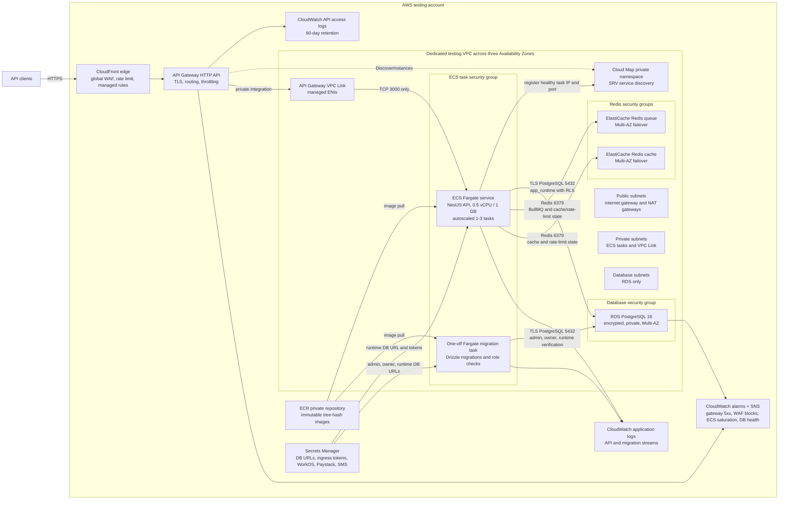
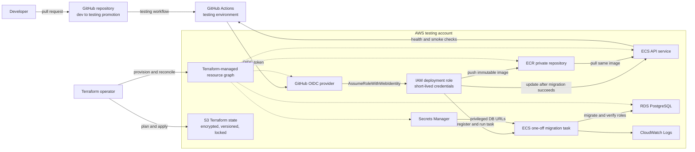

# AWS testing architecture

This diagram describes the provisioned testing environment. It uses logical resource names only;
account IDs, endpoints, subnet IDs, and secret values are deliberately omitted.

## Runtime and network flow

Only API Gateway is an inbound public entry point. The ECS security group accepts port 3000 only
from the VPC Link security group. RDS is not publicly accessible and accepts port 5432 only from
the ECS task security group.

ECS tasks run in private subnets without public IP addresses. NAT gateways provide outbound image,
AWS API, and provider access. CloudFront injects an origin-lock header for the API; direct raw
execute-api requests without that header are rejected by the API before tenant or provider handlers
run.

## Delivery and control flow

Deployment order is enforced:

1. Build and push an image tagged with the Git tree hash.
2. Ensure a first-deployment rollback image exists.
3. Run the migration task and wait for a successful exit.
4. Register the API task definition and update the ECS service.
5. Wait for container health and ECS stability.
6. Smoke-test `/health` through API Gateway.

## AWS services and roles

| Service or role           | Responsibility                                                                                                              |
| ------------------------- | --------------------------------------------------------------------------------------------------------------------------- |
| API Gateway HTTP API      | Public HTTPS endpoint, request routing, VPC integration, access logs, and basic throttling.                                 |
| CloudFront + AWS WAF      | Public edge protection in front of each testing HTTP API with IP rate limiting and AWS managed rule groups.                 |
| API Gateway VPC Link      | Carries API traffic from API Gateway into VPC network interfaces.                                                           |
| Cloud Map                 | Supplies private SRV discovery records for healthy ECS task IPs and ports.                                                  |
| ECS cluster and service   | Runs the long-lived services on Fargate with circuit-breaker rollback and Application Auto Scaling.                         |
| ECS migration task        | Runs schema migrations and verifies the least-privilege database roles before service deployment.                           |
| ECR                       | Stores immutable API images keyed by Git tree hash plus the first-deployment rollback tag.                                  |
| RDS PostgreSQL            | Stores application data in an encrypted, non-public Multi-AZ PostgreSQL instance with deletion protection.                  |
| ElastiCache Redis         | Separates queue durability from cache/rate-limit workloads using encrypted Multi-AZ Redis replication groups.               |
| Secrets Manager           | Stores database URLs, operator and webhook tokens, WorkOS placeholders, Paystack, and SMS provider credentials.             |
| ECS execution role        | Allows the ECS agent to pull ECR images, fetch specific secrets, and write container logs.                                  |
| ECS application task role | Runtime identity for future AWS API access; it currently has no additional permissions.                                     |
| GitHub OIDC provider      | Exchanges GitHub identity tokens for short-lived AWS credentials without access keys.                                       |
| GitHub deployment role    | Pushes images, registers task definitions, runs migrations, updates the testing service, and passes only the two ECS roles. |
| CloudWatch Logs           | Retains API, app, and API Gateway access logs for 90 days.                                                                  |
| CloudWatch alarms         | Detects gateway 5xx responses, global WAF block spikes, ECS saturation, high database CPU, and low database storage.        |
| S3 Terraform backend      | Stores encrypted, versioned Terraform state with native lockfiles and public access blocked.                                |

## Current testing limitations

- The AWS account plan currently caps RDS automated backup retention at one day. Upgrade the account
  plan before raising retention to the desired staging/production value.
- Customer identity authorization still needs final production policy hardening on the public API
  surface; testing uses API keys, BFF tokens, and operator/webhook shared secrets where implemented.
- `testing_alarm_email` must be set and the subscription confirmed for email alert delivery.
- Testing is wired to the real Arkesel SMS provider path. Live-send drills need approved test
  recipients, populated provider credentials, and operational monitoring of spend and delivery
  outcomes.

Staging and production still require separate AWS accounts, production backup retention and restore
tests, autoscaling, WAF/edge protection, customer auth enforcement, and production incident
management.
