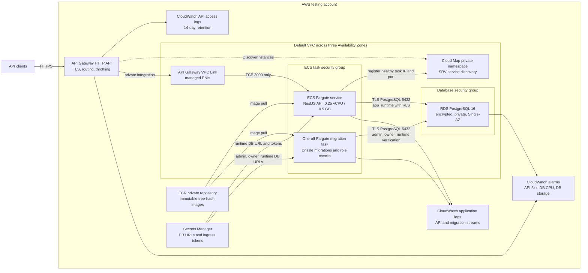
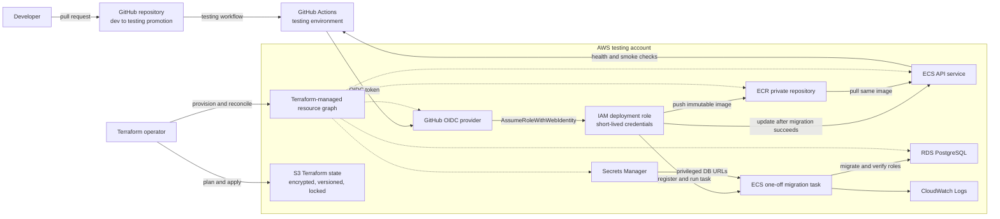

# AWS testing architecture

This diagram describes the provisioned testing environment. It uses logical resource names only;
account IDs, endpoints, subnet IDs, and secret values are deliberately omitted.

## Runtime and network flow

Only API Gateway is an inbound public entry point. The ECS security group accepts port 3000 only
from the VPC Link security group. RDS is not publicly accessible and accepts port 5432 only from
the ECS task security group.

ECS tasks currently run in default public subnets with public IP addresses for outbound AWS API and
image access. Their security group does not permit public inbound traffic.

## Delivery and control flow

Deployment order is enforced:

1. Build and push an image tagged with the Git tree hash.
2. Ensure a first-deployment rollback image exists.
3. Run the migration task and wait for a successful exit.
4. Register the API task definition and update the ECS service.
5. Wait for container health and ECS stability.
6. Smoke-test `/health` through API Gateway.

## AWS services and roles

| Service or role | Responsibility |
|---|---|
| API Gateway HTTP API | Public HTTPS endpoint, request routing, VPC integration, access logs, and basic throttling. |
| API Gateway VPC Link | Carries API traffic from API Gateway into VPC network interfaces. |
| Cloud Map | Supplies private SRV discovery records for healthy ECS task IPs and ports. |
| ECS cluster and service | Runs the long-lived NestJS API on Fargate and performs circuit-breaker rollback. |
| ECS migration task | Runs schema migrations and verifies the least-privilege database roles before service deployment. |
| ECR | Stores immutable API images keyed by Git tree hash plus the first-deployment rollback tag. |
| RDS PostgreSQL | Stores application data in an encrypted, non-public PostgreSQL instance. |
| Secrets Manager | Stores admin, migration-owner, and runtime database URLs plus operator and webhook tokens. |
| ECS execution role | Allows the ECS agent to pull ECR images, fetch specific secrets, and write container logs. |
| ECS application task role | Runtime identity for future AWS API access; it currently has no additional permissions. |
| GitHub OIDC provider | Exchanges GitHub identity tokens for short-lived AWS credentials without access keys. |
| GitHub deployment role | Pushes images, registers task definitions, runs migrations, updates the testing service, and passes only the two ECS roles. |
| CloudWatch Logs | Retains API, migration, and API Gateway access logs for 14 days. |
| CloudWatch alarms | Detects API 5xx responses, high database CPU, and low database storage. |
| S3 Terraform backend | Stores encrypted, versioned Terraform state with native lockfiles and public access blocked. |

## Current testing limitations

- RDS is Single-AZ with one-day backups and no deletion protection.
- ECS has one fixed task and no autoscaling.
- Default public subnets are used; there are no VPC endpoints or NAT gateway.
- Container Insights is disabled.
- CloudWatch alarms have no notification destination.
- API Gateway has throttling but no WAF or customer identity authorizer.

These choices control testing cost. Staging and production require separate AWS accounts,
purpose-built private networking, stronger database recovery controls, actionable alert delivery,
autoscaling, and production-grade edge protection.
