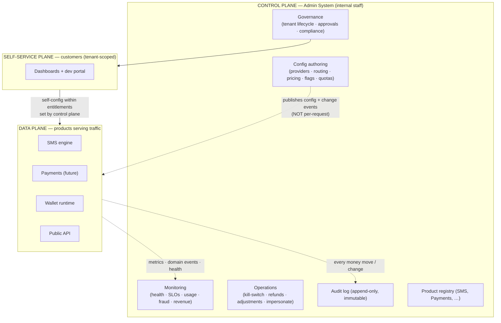
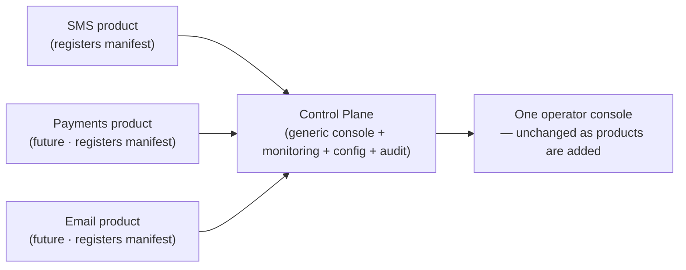
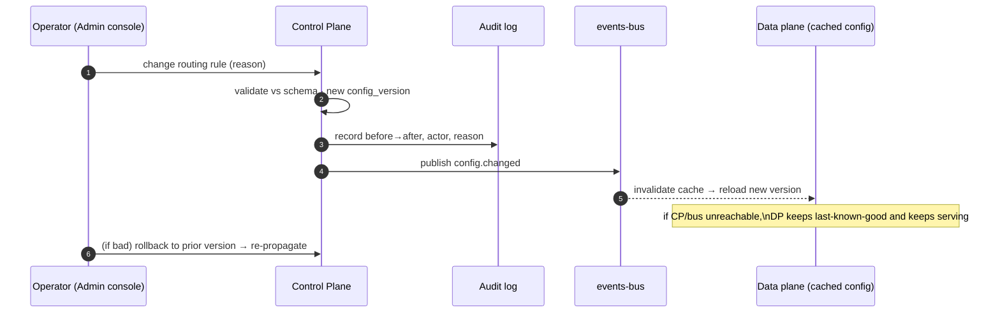
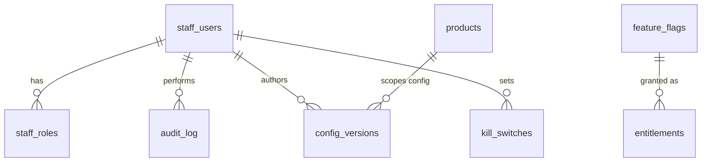

# Platform Control Plane & Admin System

**Status:** Design v1 · **Date:** 2026-05-31 · **Companion to:** all architecture docs
**Trigger:** We under-specified the internal **Administrator system that monitors and configures
everything — all products, current and future.** This is not an SMS admin panel; it is a
platform **Control Plane**. This document corrects the gap and defines where it intersects
every existing system.

---

## 0. The realization — we had been conflating three planes into one

Our docs implicitly assumed two kinds of users (developers via API, business users via
dashboard) and treated config as static rows. But there are really **three planes**, and the
one we left out is the most privileged:

| Plane | Who | What it does | Traffic | Privilege |
|---|---|---|---|---|
| **Control plane (Admin)** ← *missing* | Your staff/operators | Configure, govern, monitor **all** products | Low, bursty | God-mode |
| **Self-service plane** | Customers (tenant admins, devs) | Configure *their own* tenant within limits | Medium | Tenant-scoped |
| **Data plane** | End-recipients / API callers | Serve traffic (send SMS, charge, debit wallet) | High, constant | Request-scoped |

We designed the self-service and data planes. **The control plane is the missing third.**

---

## 1. The core principle: Control Plane ≠ Data Plane

> **The control plane configures and observes the data plane. It is NEVER in the data plane's
> hot path.**

This single rule drives the whole design:

- **Availability decoupling.** You send millions of SMS but change a routing rule rarely. If
  the Admin system is down, **sending must keep working.** Therefore the data plane reads config
  from a **local cache (last-known-good)** and degrades gracefully; the control plane *writes*
  config and *publishes change events* — it is not called per-request.
- **Blast-radius isolation.** The Admin system can rewrite pricing, kill providers, adjust
  ledgers, and impersonate tenants. A breach of the public API must **not** reach these powers.
  Separate auth, separate ingress, separate deployment, full audit.
- **Different change discipline.** A bad config change has *platform-wide* blast radius (one
  wrong routing rule breaks every send). So control-plane changes get validation, versioning,
  staged rollout, and rollback — unlike ordinary data-plane writes.
- **Different scaling/skills profile.** Low-traffic, high-privilege, internal — vs
  high-traffic, scoped, customer-facing.

This is exactly how Stripe, Twilio, AWS, and Cloudflare are built: a control plane governing a
resilient data plane that survives control-plane outages.

---

## 2. Why this is centralized from day one (the *second* exception)

`ARCHITECTURE.md` says "build in-place, extract later." Identity was the **one** exception
(`IDENTITY-SSO.md`) — centralized from day one because it can't be retrofitted. **The control
plane is the second and final such exception**, for the same reason: it is inherently
cross-product, and bolting a unified operator/config/monitoring layer onto N products that each
grew their own admin tooling is a brutal migration.

Caveat against over-building (we're a small team): centralize the **contracts and the
mechanism** now (config-as-data, audit, staff IAM, the product-registration contract). The
**console UI** can start minimal. Don't build a microservice fleet on day one — build it as an
**isolated privileged surface** over the modular monolith (separate auth + deploy), and let it
physically separate when scale/security demands.

---

## 3. The three planes + the delegation hierarchy



**Delegation = the config precedence ladder we already designed.** In
`INTEGRATIONS-PLUGIN-ARCHITECTURE.md §6` config resolves *platform default → tenant override →
request hint*. That ladder **is** the delegation model:

```
Control plane authors  →  PLATFORM DEFAULTS + the entitlement BOUNDS
        ▼
Tenant self-serves     →  within those bounds (their senders, webhooks, BYO provider)
        ▼
Per-request hint       →  within what the tenant is allowed
```

So the control plane isn't a new concept bolted on — it's the **authoring authority for the
top rung** of a ladder we already built.

---

## 4. Responsibilities (the four jobs of the control plane)

### 4.1 CONFIGURE (the "configures everything" part)
Authoritative authoring + propagation of all platform config — **most of these entities already
exist; the control plane is recognized as their owner/editor:**
- Plugin/provider **instances**: install, enable/disable, credentials, health thresholds (`integration_instances`)
- **Routing rules**: default + fallback chains, weights, least-cost policy (`routing_rules`)
- **Supported currencies + default currency** (platform-level; optionally narrowed per tenant) —
  wallet creation, pricing, and top-ups validate against this set; enabling a new currency is a
  **config change, no migration** ← *currency is config, not code* (`config` / `system_settings`)
- **Pricing / rate cards** per currency·destination·product (`price_lists`)
- **Feature flags & entitlements** per plan and per tenant ← *new system*
- **Rate limits / quotas** (global + per tenant)
- **Global settings**, per-country compliance rules, retention/redaction defaults
- **Product registry** — which verticals exist + their admin contract ← *new system*

### 4.2 MONITOR (the "monitors everything" part)
A unified operator view fed by data-plane telemetry (it consumes, never blocks):
- Cross-product health, SLOs, alerts, incident surface
- Provider health + circuit states + **delivery-quality scores** (ties to the "cost-per-delivered" wedge)
- Per-tenant usage, spend, anomaly/fraud detection (traffic pumping)
- **Ledger invariant monitoring** (money correctness — `ARCHITECTURE.md §5`)
- Business metrics: revenue/MRR, usage by product/tenant
- Drill-down to a single message / transaction / wallet for support

### 4.3 GOVERN
- **Tenant lifecycle**: provision, suspend, plan changes, KYC/compliance state, **`data_region`**
- **Sender-ID approvals** (operator approves/rejects tenant sender IDs — `sms/providers`)
- Risk/compliance actions: freeze account, block sender, enforce consent
- **Data protection (`COMPLIANCE-AND-DATA-PROTECTION.md`):** execute **DSRs** (data-subject access /
  erasure — erasure = trigger crypto-shred of the subject's DEK); maintain the **sub-processor list**
  (auto-rendered from enabled `integration_instances`); manage data-residency per tenant

### 4.4 OPERATE
- **Kill-switches**: disable a provider/route platform-wide; force failover; drain a queue
- **Support tooling**: inspect a tenant's messages/wallet; time-boxed **impersonation**
- **Money operations**: manual credits/refunds/adjustments — **dual-control (maker-checker)** + audit
- Incident response controls; replay failed webhooks/DLRs
- **Breach response**: detect → contain → assess → **notify DPA + affected** within statutory window
  (GDPR 72h; align local) → remediate; the audit log + event stream feed the assessment

---

## 5. Where it "comes to play" — touchpoint map to every module

| Module (existing) | What the control plane does to it |
|---|---|
| `platform/integrations` | Authors plugin instances + routing rules; kill-switch/force-failover; reads health into monitoring |
| `platform/wallet` | Monitors ledger invariant; operators post audited manual adjustments (dual-control) |
| `platform/billing` | Authors price lists / plans / entitlements; monitors revenue/usage |
| `platform/identity` | Tenant lifecycle (provision/suspend/plan); **distinct staff IAM** (§7) |
| `platform/api-keys` | Global + per-tenant rate limits / quotas; revoke keys on abuse |
| `platform/webhooks` + `events-bus` | **Consumes the same outbox events** for real-time ops dashboards; replay failed deliveries |
| `sms/engine` + `sms/dlr` | Monitors delivery quality/volumes; global retention/redaction defaults; message inspection for support |
| `sms/providers` | Sender-ID approval workflow; provider credential management |
| **Future products** | Register via the **product contract (§6)** → instantly monitorable + configurable, no console changes |

**Key insight:** the control plane already has hooks into everything because everything we built
emits **domain events (outbox)**, exposes **config-as-data**, and has **health**. The control
plane is the consumer/authority over those three streams. We don't need to re-instrument — we
need to *aggregate and govern*.

---

## 6. The product registration contract — the "all future apps" mechanism ★

This is the heart of "monitors and configures everything, including future ones." The control
plane must be **product-agnostic** — the same philosophy as the vendor-plugin framework, one
altitude up:

> **Vendor plugins** plug vendors into a product. **Products** plug into the control plane.
> Same pattern, two levels. Share the *mechanism*, not the *specifics*.

Each product (SMS now; Payments, Email later) registers a manifest:

```ts
interface ProductManifest {
  slug: string;                       // 'sms', 'payments'
  name: string; version: string;
  configSchema: JSONSchema;           // → control plane renders config UI generically
  entitlements: EntitlementDef[];     // feature flags this product gates on
  metrics: MetricDef[];               // KPIs it emits → generic dashboards
  healthChecks: HealthCheckDef[];     // readiness/liveness → generic monitoring
  adminActions: AdminActionDef[];     // ops it supports (kill-switch/drain/replay) + required role
  auditedEvents: string[];            // which events/actions must be audited
}
```



Add a product → it registers → it is **instantly** configurable, monitorable, auditable, and
gated by entitlements, with **zero console code changes**. That is the platform promise made
real for internal ops.

---

## 7. Staff identity & access — separate from customers

The grep proved every "admin" in our docs is a *customer* role. Operators are a different
population and must be modeled separately.

- **Separate staff identity**: a dedicated WorkOS Organization (or separate connection) for
  internal staff — **NOT** mixed with customer tenants. Staff never live in a customer org.
- **MFA mandatory for ALL staff** (stronger than the customer policy of admin/owner-only).
- **Fine-grained admin RBAC**, least privilege by function:
  `super_admin · platform_ops · finance · support · compliance · read_only`.
- **Step-up auth** for dangerous actions (refunds, ledger adjustments, impersonation, kill-switch).
- **Dual-control (maker-checker)** for money movements and destructive config.
- **Impersonation** is explicit, time-boxed, reason-logged, and consented per policy — never silent.

---

## 8. Audit — a first-class, immutable system

`ARCHITECTURE.md:336` mentions an audit log as a security note. Promote it to a **system**:

- **Append-only, immutable, tamper-evident** record of every control-plane action and every
  money movement, platform-wide.
- Captures: `actor (staff/system)`, `action`, `target (tenant/resource)`, `before → after`,
  `reason`, `ip`, `request_id`, `timestamp`.
- This is both compliance and operational gold — "why did all sends fail at 14:00? → operator X
  changed routing rule Y" is answerable in seconds.

---

## 9. Configuration safety — because blast radius is platform-wide

Control-plane writes are high-stakes, so they get discipline ordinary writes don't:
- **Schema validation** before apply (against the product/plugin `configSchema`).
- **Versioned config + rollback** (`config_versions`) — every change is a new version; revert is one click.
- **Staged rollout / canary** for high-impact changes (e.g. apply a routing change to 10% then 100%).
- **Dry-run / preview** where feasible.
- **Change propagation**: write config → bump version → publish `config.changed` event →
  data-plane instances **refresh their cache** (TTL + event-driven invalidation). Data plane
  keeps **last-known-good** if the control plane is unreachable → graceful degradation.



---

## 10. Monitoring architecture (what feeds the operator view)

The control plane **consumes** existing telemetry — no new instrumentation needed:
- **Metrics** (OpenTelemetry/Prometheus from `ARCHITECTURE.md §10`) → SLO + health dashboards
- **Domain events** (the outbox/`events-bus`) → real-time operational + business dashboards
- **Health checks** from each product/plugin (`healthChecks` in the manifest)
- **Ledger invariant checker** (`wallet`) → money-correctness alarms
- **Logs/traces** correlated by `tenant_id · request_id · trace_id`
Surfaces: SLOs, alerts, incident view, per-tenant drill-down, fraud/anomaly detection, revenue.

---

## 11. New / promoted entities

Most config entities already exist (`integration_instances`, `routing_rules`, `price_lists`,
`account_settings`); the control plane *owns/edits* them. **Genuinely new** entities:

```sql
-- Staff identity & access (separate from customer users)
staff_users(id, external_subject_id UNIQUE, email, name, status, last_login_at)
staff_roles(id, staff_user_id→staff_users, role, granted_by, granted_at)

-- Immutable audit (platform-wide)
audit_log(id, actor_type[staff|system], actor_id, action, target_type, target_id,
          before jsonb, after jsonb, reason, ip, request_id, created_at)   -- append-only

-- Versioned config with rollback
config_versions(id, scope[platform|tenant], resource_type, resource_id,
                version, payload jsonb, created_by→staff_users, created_at, active bool)

-- Feature flags & entitlements
feature_flags(id, key, description, default_value)
entitlements(id, subject_type[plan|tenant], subject_id, feature_key, value, updated_by, updated_at)

-- Product registry (the future-proofing contract)
products(slug PK, name, version, manifest jsonb, status)

-- Operational controls
kill_switches(id, scope, target_type, target_id, active, reason, set_by→staff_users, set_at)
```



---

## 12. Module placement (extends MODULE-DECOMPOSITION.md)

A new shared module group, sibling to identity in the platform core:

```
platform/
├─ control-plane/
│  ├─ staff-iam/        # staff identity + admin RBAC + step-up (separate from customer identity)
│  ├─ config/           # config authoring, versioning, validation, propagation
│  ├─ audit/            # append-only audit (promoted from a security note)
│  ├─ entitlements/     # feature flags + plan/tenant entitlements
│  ├─ product-registry/ # ProductManifest registration (§6)
│  ├─ observability/    # aggregates metrics/events/health into operator views
│  └─ ops/              # kill-switches, impersonation, money-ops (maker-checker)
└─ interfaces/
   └─ admin-api + admin-console   # ISOLATED deployable (separate auth + ingress)
```

Dependency rule holds: `control-plane/*` may read platform + product state and **govern** it,
but products do **not** depend on the control plane at request time (they read cached config).

---

## 13. Isolation & deployment (security)

- **Separate deployable** for `admin-api`/`admin-console` from day one — own ingress, **not
  publicly exposed** (VPN/IP-allowlist/SSO-gated), even though code may share the monolith.
- **Separate auth boundary** (staff IdP), separate session/cookie domain (`admin.platform.com`).
- **Network policy**: control plane may reach data-plane DB/config; the public API cannot reach
  control-plane tables/actions.
- All privileged actions: step-up auth + dual-control + audit (as above).

---

## 14. Phasing (don't over-build)

- **P1 (now):** staff IAM (WorkOS staff org, MFA-all), `audit_log`, config-as-data already
  exists — add a **minimal internal admin console** (CRUD over providers/routing/pricing +
  read-only monitoring + sender-ID approvals + wallet inspect/adjust with maker-checker).
  Define the `ProductManifest` contract; SMS registers as the first product.
- **P2:** config versioning + rollback, entitlements/feature-flag UI, fraud/anomaly dashboards,
  impersonation tooling, kill-switches, webhook/DLR replay.
- **P3:** staged/canary config rollout, advanced SLO/incident tooling, multi-product revenue
  analytics, self-service operator workflows.

---

## 15. Cross-doc impacts — ✅ APPLIED 2026-05-31

| Doc | Change |
|---|---|
| `ARCHITECTURE.md` | Add the **three-plane model**; name the control plane as the **2nd day-one exception**; promote audit + add staff-IAM, entitlements, product-registry, config-versioning to the platform core; add a decision-log row |
| `MODULE-DECOMPOSITION.md` | Add the `platform/control-plane/*` module group (§12 here) + entities + `admin-api`/`console` interface; note existing config entities are control-plane-owned |
| `IDENTITY-SSO.md` | Add **staff/operator identity** (separate WorkOS org, MFA-all, admin RBAC, step-up, impersonation rules) — distinct from customer SSO |
| `INTEGRATIONS-PLUGIN-ARCHITECTURE.md` | Note that instance/routing config **authoring** lives in the control plane; data plane consumes cached config (already aligned with §6 precedence) |

---

## 16. Open decisions

1. **Staff identity:** separate WorkOS Organization (recommended) vs a fully separate IdP for
   internal staff?
2. **Admin console build:** internal-only minimal CRUD now (recommended), or invest earlier in a
   richer ops platform?
3. **Maker-checker scope:** which actions require dual-control at launch — money only
   (recommended), or also destructive config (kill-switch, pricing)?
4. **Impersonation policy:** allowed at launch with audit + time-box (recommended for support),
   or deferred to P2?
```
