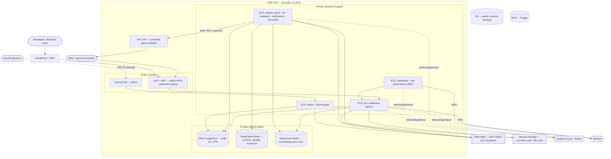
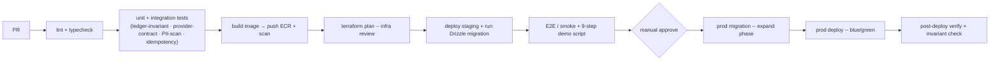

# Deployment & DevOps

**Status:** Design v1 · **Date:** 2026-06-03 · **Companion to:** all architecture + PI-1 docs
**Stack decisions (locked):** **AWS Africa (Cape Town, af-south-1)** · **ECS Fargate** (managed
containers) · **Grafana Cloud + Sentry** (observability) · **Terraform** (IaC) · **GitHub Actions** (CI/CD).

> Region rationale (`research, 2026`): no hyperscaler has a full **in-Nigeria** region; Cape Town
> (3 AZs) is the closest full African region and where most African fintech runs. Nigerian
> cross-border data is restricted by NDPA — so we pair Cape Town with **documented NDPA safeguards
> (CBDTI/contractual)**, a **no-CNII-ingestion** stance (we don't store BVN/NIN/NIBSS), and a
> **per-tenant in-Nigeria** escape hatch. **Counsel must confirm the safeguard mechanism.**

---

## 0. Principles (DevOps must honor the architecture)
1. **Three planes = separate deployables.** Data plane, self-service plane, and **control plane (admin)** deploy independently; admin is **not internet-exposed**.
2. **Config ≠ deploy.** Control-plane config changes propagate at runtime (cached); they must **never** require a redeploy.
3. **The ledger is sacred.** Managed Postgres, Multi-AZ, PITR; migrations are expand-contract; the **ledger-invariant** is a release gate.
4. **KMS is on the hot path.** Per-subject DEK envelope encryption (F7.1) → managed KMS, with DEK caching + fail-closed.
5. **Residency-bound.** Primary data stays in af-south-1; cross-border only with safeguards; per-tenant residency is a Terraform module, not a fork.
6. **Lean + certifiable.** Managed-but-cost-aware; least-privilege, audited prod access (ISO/SOC-ready).

---

## 1. Topology

**Deployables (ECS Fargate services):**
- **`api`** — public REST API + `webhooks-ingress` (DLR, payment, inbound MO). Behind ALB+WAF+CloudFront.
- **`worker`** — BullMQ consumers: send dispatch, DLR reconcile, reservation sweeper (F3.3), payment reconcile/sweeper (F4.3), notifications (F1.6), DLR-trust probes (F7.5), outbox relay (F1.2).
- **`admin`** — control plane; **separate internal ALB**, reachable only via VPN/IP-allowlist + staff SSO. Never public.
- **`portal`** — Next.js dashboard + dev portal (BFF holds WorkOS tokens server-side); static assets via CloudFront/S3.

---

## 2. AWS service mapping

| Concern | Service | Notes |
|---|---|---|
| Compute | **ECS Fargate** | One service per deployable; autoscaling; no servers to patch |
| Images | **ECR** | Built in CI; **scan on push + dependency scan + SBOM + image signing** (supply-chain) |
| Edge | **ALB + AWS WAF (+ Shield) ; CloudFront for portal/static** | WAF + **Shield** (DDoS) on the public API's ALB; CloudFront for static/portal (API responses aren't cacheable); admin on a separate **internal** ALB |
| DNS / TLS | **Route 53 + ACM** | `api.` / `developers.` / `admin.` / `auth.` (WorkOS custom domain) |
| Database | **RDS for PostgreSQL** | Multi-AZ, PITR, KMS-encrypted, **RDS Proxy** for pooling (verify Proxy availability in af-south-1) |
| **Queue** | **ElastiCache Redis (dedicated, node-based + Multi-AZ)** | BullMQ — **`noeviction` + AOF persistence**; must **not** share with cache; **NOT ElastiCache *Serverless*** (its maxmemory-policy is incompatible with BullMQ) |
| **Cache / rate-limit** | **ElastiCache Redis (separate)** | Idempotency hot cache + rate-limit buckets — **LRU eviction** ok here |
| Keys | **AWS KMS** | Master key wraps per-subject DEKs (F7.1); encrypts RDS/Redis/S3 |
| Secrets | **Secrets Manager** | Provider creds, DB creds; rotation enabled |
| Storage | **S3** | Static assets, data exports (DSR), backup artifacts — encrypted |
| Egress | **NAT GW + allowlist** | Outbound only to known provider/webhook destinations (SSRF defense, F8.4) |
| Observability | **Grafana Cloud + Sentry** (+ CloudWatch backstop) | OTel/ADOT collector ships metrics/logs/traces |

---

## 3. Environments & promotion

- **Start with local + staging + prod** (each prod/staging an **isolated AWS account** for blast-radius + certifiability); add **dev account** and **ephemeral preview envs** per PR as a fast-follow. *(Reconciles §14 phasing — staging+prod first.)*
- **Test mode is app-level, not infra:** `sk_test_` keys + `FakeProvider` (F8.5) run on the *same* prod infra — not a separate environment.
- **Staging must NEVER contain production PII** (NDPA + our tokenization model). Staging uses **synthetic/anonymized seed data**; a PITR **restore drill** (§10) goes into an **isolated, access-controlled** target, not shared staging.
- Promotion = same immutable image artifact moved across envs (build once, deploy many).

---

## 4. CI/CD pipeline (GitHub Actions)

**Release gates (must pass):** the **ledger-invariant** test (F1.5), **provider-contract** conformance (F5.1), the **PII-scan** test (no raw PII in logs, F1.5/F7.1), and idempotency/concurrency tests (F3.2/F8.2).
**Blue/green** for the data plane (ECS + CodeDeploy, verify availability in af-south-1) → instant rollback. **Config changes never go through this pipeline** — they're authored in the control plane (F9.1) and propagate at runtime.
- **CI → AWS auth via GitHub OIDC** (assume a scoped IAM role) — **no long-lived AWS keys** in GitHub. Terraform state in S3 (encrypted) + DynamoDB lock, access-restricted.
- **Migration-failure handling:** expand-phase migrations run *before* the new code and are compatible with **both** running versions (blue/green); a failed migration **aborts the deploy** (code never ships against a half-applied schema) and triggers the migration runbook. Contract/cleanup happens in a *later* release, never alongside expand.

---

## 5. Database migration discipline

- **Drizzle migrations** run in CI, gated, never auto-applied to prod without the migration step.
- **Expand-contract** (a.k.a. parallel-change) for zero-downtime: add new columns/tables → deploy code that writes both → backfill → switch reads → drop old in a later release. Never a breaking change in one step.
- **Ledger + PII tables are append-only / tokenized** — migrations must preserve immutability and the `subject_id`/`pii_vault` model; no migration introduces a raw-PII column (lint gate, F7.1).
- Every migration is reversible or has a tested forward-fix; run against a staging clone first.

---

## 6. Secrets & KMS

- **Envelope encryption (F7.1):** KMS master key wraps per-subject DEKs; only wrapped DEKs stored; **DEK cache (short TTL)** keeps PII reads off the KMS hot path; **fail-closed** if KMS is unavailable (never store plaintext).
- **Provider/payment credentials** in Secrets Manager (per provider instance), referenced by the integrations layer; rotation enabled.
- **No secrets in env files or images**; injected at runtime from Secrets Manager.
- **Master-key rotation** re-wraps DEKs without re-shredding subjects; audited.

---

## 7. Networking & security

- **VPC**: public subnets hold only the ALBs; **Fargate, RDS, Redis live in private subnets** (no public IPs).
- **Admin isolation**: separate internal ALB, reachable via **AWS Client VPN / IP-allowlist + staff SSO + step-up** (F2.2). Network policy forbids the public API path from reaching control-plane-only resources.
- **Egress control**: NAT GW + allowlist so outbound traffic only reaches known providers/endpoints — backs the **webhook SSRF** defense (F8.4) and limits exfiltration.
- **WAF + AWS Shield** on the public edge (DDoS protection; tune WAF rules to avoid blocking legit payment/SMS traffic); **TLS everywhere** (ACM); VPC endpoints for AWS service calls (keep traffic off the internet).
- **Least privilege IAM** per service; no shared god-role; **CloudTrail** records all AWS API/access for audit (certifiability).

---

## 8. Observability & on-call

- **Metrics/logs/traces → Grafana Cloud** via an OTel/ADOT collector; `tenant_id`+`request_id`+`trace_id` on everything (F1.5).
- **PII scrubbed at source — *before* telemetry leaves the VPC.** Grafana Cloud + Sentry are sub-processors abroad; scrubbing must happen in-collector/in-app, not at the destination (and confirm their storage regions, §11).
- **Sentry** for application errors/exceptions; **CloudWatch** as the AWS-native backstop; **CloudTrail** for AWS API/access audit.
- **External synthetic uptime checks** (independent probe) drive the **status page** (Instatus/hosted) — a real signal, not self-reported; ties to the reliability positioning.
- **SLOs (set targets, track error budget):** e.g. API availability 99.9%, p95 send-accept latency, DLR-reconciliation lag, top-up success rate. (Closes the PI-1 NFR gap.)
- **Golden signals + business alarms:** ledger-invariant breach (page immediately), queue backlog, provider error-rate spike, DLR-trust divergence (F7.5), open-reservation backlog (F3.3), failed payment reconciliation (F4.3).
- **Runbooks (money-platform):** ledger-invariant breach · provider outage (single-provider, no PI-1 failover) · payment-reconciliation failure · stuck-reservation surge · region degradation · breach-response (`COMPLIANCE §12`). **On-call** rotation + tooling (Grafana OnCall / PagerDuty / Opsgenie — open item); start lightweight.

---

## 9. Scaling

- **`api`** autoscales on CPU/req concurrency; **`worker`** autoscales on **queue depth** (BullMQ) so send throughput scales with load.
- **Graceful worker deploys:** on SIGTERM, workers **stop accepting new jobs and drain in-flight ones** before exit (ECS stop-timeout tuned); send dispatch is **idempotent** so a redeploy/retry never double-sends. *(Blue/green covers the API; workers need explicit drain.)*
- **Provider TPS caps**: workers respect per-provider rate limits (PI-2 hardening, gap C1); Redis token buckets shared across worker tasks.
- **DB**: RDS Proxy pooling; read replicas added when read load demands (reporting/usage queries). Ledger writes stay on primary.
- **Bulk fan-out** (F5.6) flows through the queue so it can't starve transactional sends (separate queues/priorities).

---

## 10. DR & backup — with the residency tension

- **Targets (set explicitly for a money platform):** define **RTO** (time-to-restore) and **RPO** (max acceptable data loss) — e.g. AZ failure RTO/RPO ≈ near-zero (Multi-AZ); region loss RTO = hours / RPO = last backup. Tune backup frequency to the chosen RPO.
- **HA**: RDS **Multi-AZ** across af-south-1's 3 AZs; ElastiCache Multi-AZ; Fargate spread across AZs.
- **Backups**: RDS automated backups + **PITR**; periodic snapshots to encrypted S3.
- **The tension + the compromise**: AWS's only full African region is Cape Town, so **cross-region DR leaves the continent** — colliding with residency. **PI-1 decision:** Multi-AZ + PITR **in-region**; the recommended DR compromise is **encrypted cross-region backup *copies* with the KMS key kept in-region** (data unreadable abroad → residency-defensible), rather than "in-region only, accept total region-loss." **Counsel-gated**; document the residual risk + RTO/RPO.
- **Restore drills**: periodic PITR restore test into an **isolated, access-controlled** target (NOT shared staging — no prod PII leak); proves backups are usable + the ledger reconstructs from entries.

---

## 11. Data-residency operations

> **Re-scoped after field research (2026-06-03): residency is *per-data-class*, not per-tenant.**
> Nigerian law mandates in-country storage for a **narrow** set — **BVN, NIN/NIBSS (CNII), and
> domestic card/POS/ATM switching** — **not** a whole tenant's stack. Real practice (Moniepoint =
> regulated data on-prem + everything else on cloud; TymeBank, a licensed bank, on af-south-1)
> confirms a **data-class split**, not blanket localization. Since **we're a CPaaS and don't ingest
> BVN/NIN/card-switching data**, our own data (phone, message body, wallet) likely needs only **NDPA
> transfer safeguards** — *not* in-country compute.

- **Primary**: all tenant data in af-south-1; `data_region` (F7.6) tags tenants/instances.
- **NDPA cross-border safeguards** (the real mechanism): a documented **Transfer Impact Assessment (TIA) + SCCs + consent at onboarding** — NDPC has **no adequacy whitelist** yet, so TIA+SCC is the route. GAID live (Sep 2025); register as controller/processor of major importance + file the annual audit. Each external vendor (WorkOS, Sentry, Grafana Cloud, SMS/payment providers) is a **sub-processor** (`COMPLIANCE §7`); verify each one's data location + DPA.
- ⚠️ **Enforcement is real:** MultiChoice fined **₦766m for unconsented cross-border transfer**; NDPC issued mass compliance notices. **Consent + lawful-basis design at onboarding is the hot spot — get it right.**
- **No CNII ingestion**: platform does not store BVN/NIN/NIBSS data; data-classification policy enforced. (This is *why* Cape Town + safeguards is sufficient for our data.)
- **If in-country compute is ever required** (regulated client contract, or pursuing a banking/PSB licence where primary servers can't be public-cloud): use **AWS Outposts (available in Nigeria since 2022) or the Lagos Local Zone** (keeps the AWS control plane) before considering colo (Rack Centre / Equinix-MainOne). A Terraform module deploys this slice — the dedicated-deployment escape hatch (`ARCHITECTURE §2`). Deferred until contractually required.
- ⚠️ **Check vendor residency:** confirm Grafana Cloud / Sentry / WorkOS storage regions vs NDPA before sending PII-bearing telemetry; **scrub PII at source regardless** (F1.5).

---

## 12. Production access control (certifiability)

- **No standing prod DB access.** Access via **break-glass**: time-boxed, reason-logged, approved, fully audited (F1.4) — mirrors the control-plane maker-checker ethos.
- **Separate AWS accounts** per env; SSO-federated human access; CI deploys via a scoped role, not personal creds.
- All infra changes via **Terraform PRs** (reviewed, logged) — no console click-ops in prod.
- This posture is what makes ISO 27001 / SOC 2 achievable later without a re-architecture.

---

## 13. Cost posture & af-south-1 caveats
**Budget the Cape Town premium (real numbers):** af-south-1 runs **~20–32% higher on compute** and **~70% higher on egress** than us-east-1/Ireland — material for a high-volume messaging platform. Plus **dollar-priced cloud FX exposure** (a recurring African-fintech pain) — model it in unit economics.
Managed-but-lean: Fargate (no idle servers), **Graviton M7g/M8g/T4g (GA in af-south-1) + aggressive CDN/caching to claw back the premium**, RDS right-sized, Grafana Cloud (not Datadog), S3 lifecycle for old logs/exports, single-region. Keep a **warm baseline task count** for latency-sensitive services (Fargate cold-start) and consider **EC2/Compute Savings Plans for steady-state workers** vs Fargate's premium. Watch NAT GW + cross-AZ + cross-region egress + observability ingest (the usual silent cost leaders).

> ⚠️ **Cape Town reality check (do before committing the Terraform):** af-south-1 is one of AWS's
> **pricier regions** and has **thinner service/instance availability** than primary regions.
> **Verify each dependency is GA in af-south-1** — RDS Proxy, ECS blue/green (CodeDeploy), the chosen
> Graviton/instance types, Aurora options, newer features — and plan fallbacks where absent. Budget the
> regional price premium.

**Future note:** the "roll-our-own SMPP gateway" (`INTEGRATIONS §10b`) needs persistent SMPP binds + a 24/7 NOC — a materially different infra/cost profile; revisit orchestration (likely Kubernetes) when that lands.

---

## 14. Phasing — stand up before / during PI-1

**Iteration 0 (infra enablers — before feature work):**
- Terraform baseline (state in S3 + DynamoDB lock), **staging + prod AWS accounts**, VPC, RDS, **two ElastiCache Redis (queue + cache)**, KMS, Secrets Manager, ECR, CloudTrail.
- One Fargate service skeleton + ALB + WAF/Shield (CloudFront for portal/static); GitHub Actions skeleton with **OIDC→AWS** (build→test→migrate→deploy); Grafana Cloud + Sentry wiring (PII-scrub at source); synthetic uptime + a basic status page.
- **Verify af-south-1 service availability** (§13) before committing the topology.

**During PI-1:** add the `worker`/`admin`/`portal` services; blue/green; release gates; on-call + runbooks; PITR restore drill.
**Fast-follow / PI-2:** preview envs, cross-region DR decision, per-tenant residency module, Kubernetes (only if scale/SMPP demands).

---

## 15. Open items
1. **Counsel-confirm** the NDPA cross-border safeguard mechanism (CBDTI vs contractual) for Cape Town hosting.
2. **Vendor residency check**: Grafana Cloud / Sentry / WorkOS storage regions vs NDPA (+ PII scrubbing from telemetry).
3. **Separate-AWS-accounts-per-env** vs single-account-multi-VPC (recommend separate accounts).
4. **Status-page** tool choice; **on-call** tooling (PagerDuty vs Grafana OnCall vs Opsgenie).
5. Cross-region DR posture: confirm the **encrypted cross-region backup-copy (key in-region)** compromise + **RTO/RPO** targets.
6. **Verify af-south-1 availability** of every dependency (RDS Proxy, CodeDeploy/ECS blue-green, Graviton/instance types) + budget the regional price premium.
7. **SLO targets** (availability/latency/error budget) to set at PI planning.
8. **Lagos Local Zone + CloudFront from day one** for West-African latency (OTP/auth-sensitive paths) — our users are far from Cape Town.

---

## 16. Field evidence & hardening (from real adopters)

Researched 2026-06-03 (AWS blogs/re:Post, fintech eng blogs, BullMQ/PG/Terraform sources). WHAT → HOW.

### Validations (peers run our exact shape)
- **af-south-1 is production-proven for fintech/payments:** **TymeBank** (licensed bank, ~85% on ECS/EKS), **Luno/Ozow/JUMO**, and **Africa's Talking (a CPaaS) on AWS**. Aurora SV2 + RDS Proxy + Fargate + KMS are GA in Cape Town. → choice validated.
- **Redis split + `noeviction`** is the documented BullMQ requirement (it warns if violated). Validated; refined: **avoid ElastiCache Serverless**.
- **Hybrid data-class residency** (regulated in-country, rest on cloud) is the real pattern (Moniepoint/Interswitch) — validated our re-scope (§11).

### Latency reality (the one to design around)
- Cape Town ≈ **40–60 ms** within South Africa, but **~80–120 ms Lagos↔Cape Town** (sometimes routed via London). **HOW:** **Lagos Local Zone (live since Jan 2023) + CloudFront edges** day-one for latency-sensitive paths (OTP/auth); async payment/SMS tolerates the hop.

### Hardening checklist (verify/add before PI-1)
1. **Redis for BullMQ:** dedicated node-based cluster, **`noeviction` + AOF + Multi-AZ**, **not Serverless**; `removeOnComplete/Fail` to bound memory; shared `ioredis` connection (don't let every task open many). *(highest-risk item)*
2. **Idempotent consumers + idempotency keys on every payment side-effect** — at-least-once + stalled-job replays *will* duplicate; non-negotiable for money. Tune `lockDuration`; keep handlers non-blocking.
3. **Fargate subnet sizing:** large multi-AZ private subnets (**/20+**) / secondary CIDRs — **no ENI trunking on Fargate**, so small subnets cap autoscaling (`RESOURCE:ENI` PENDING).
4. **Worker SIGTERM draining:** proper **PID-1 init (tini/`exec`)** so signals reach the app; stop accepting work → finish/checkpoint → exit; tune `stopTimeout`; FARGATE_SPOT = hard 120 s, self-deregister from target group.
5. **RDS Proxy** (or PgBouncer) **before** Fargate autoscaling goes live; caveats: **VPC-only, not for Aurora SV2, session-pinning (temp tables/advisory locks/SET) collapses pooling** — avoid pin-triggering SQL.
6. **Migration safety rails in CI:** mandatory **`lock_timeout` + `statement_timeout` on DDL**, **advisory lock per migration** (two runners = corruption), **`CREATE INDEX CONCURRENTLY`**, nullable-add → batch backfill → `NOT VALID`/`VALIDATE` for constraints; volatile defaults (`now()`/`gen_random_uuid()`) rewrite the table — avoid.
7. **RLS hardening:** app connects as a **non-owner role** (table owner/superuser **bypasses RLS** → silent cross-tenant leak); **`tenant_id` as the leading index column** (else ~100× slower); **`SET LOCAL` per transaction** (pooled `SET` leaks across requests); **pgTAP cross-tenant isolation tests gating CI**.
8. **Noisy-neighbor (RLS isolates rows, not resources):** per-tenant rate limits (F8.7), `statement_timeout`, analytics on read replicas, plan to peel off whale tenants.
9. **Terraform:** per-env/account **state isolation** + S3-encrypted + DynamoDB lock; **secrets out of state** (Secrets Manager refs); scheduled **drift detection**; per-tenant infra via one module + `for_each`, not copies.
10. **af-south-1 opt-in friction:** enable region per account; **regional STS endpoints / "valid in all regions"**; Terraform `skip_region_validation`; confirm AWS Backup org-policy + every third-party SaaS supports af-south-1; pre-file **Service Quota** increases + **Capacity Reservations** for critical tiers (smaller region = tighter capacity).

### Sources
af-south-1 cost/availability: holori region index · cloudprice · lastweekinaws · AWS Bedrock-CapeTown blog · AWS Local Zones (Lagos). · Fintech hosting: Moniepoint (GCP case study) · TymeBank/Luno (AWS Cape Town) · Paystack/Flutterwave eng blogs · Banwo-Ighodalo + ICLG/Chambers (NDPA/CBN) · techpoint (NDPC fines). · Ops: BullMQ going-to-production + ElastiCache guide · AWS Containers graceful-shutdown · re:Post ENI exhaustion · RevenueCat PgBouncer-on-ECS · expand/contract + PG lock-timeout writeups · Nile/AWS RLS multi-tenancy.
