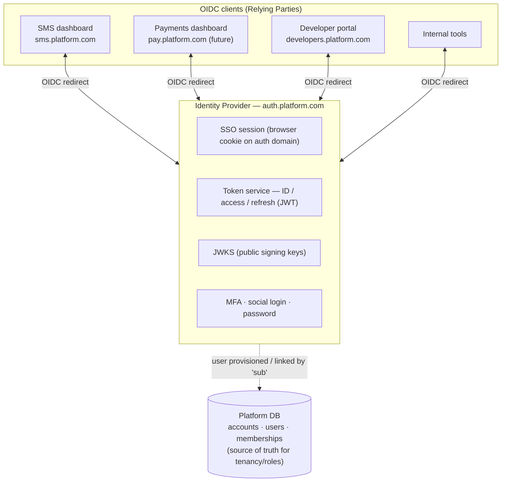
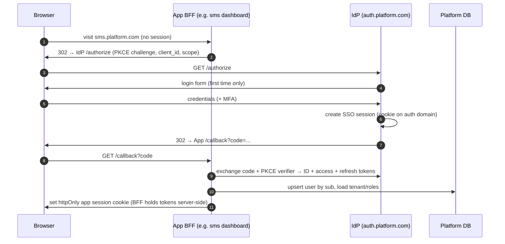
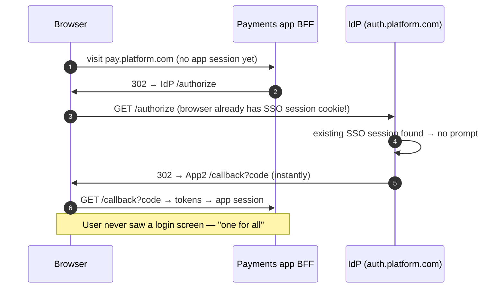
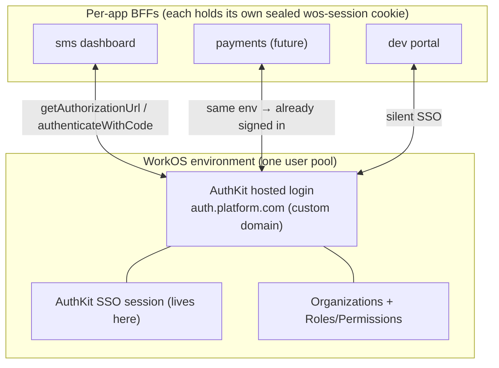

# Identity & SSO — "One Login for All Apps"

**Status:** Design v1 · **Date:** 2026-05-31 · **Companion to:** `ARCHITECTURE.md`, `MODULE-DECOMPOSITION.md`

> **Architectural exception:** every other shared capability follows "build in-place, extract
> on product #2." **Identity does not.** It is centralized from day one, because SSO cannot be
> cleanly retrofitted once multiple apps each own their own login. This is the *first* and
> *only* shared service that exists as a standalone concern before product #2 arrives.

---

## 0. Two layers — don't conflate them

| Layer | Who logs in | When | Status |
|---|---|---|---|
| **A. Platform SSO** | *Your* users (devs, business users, staff) into *your* apps | **Now** | This document |
| **B. Auth-as-a-Product** | *Your customers'* end-users, via your Auth API | Much later (was in the vision) | Out of scope; design leaves room |

Everything below is **Layer A**. The same OIDC engine can later be multi-tenanted into Layer B,
but we do not pay for that now.

---

## 1. The model: one IdP, many apps

You are building a **central Identity Provider (IdP)** that speaks **OpenID Connect (OIDC)**
(the identity layer on top of OAuth 2.0). Every app you ever build becomes an **OIDC client
(Relying Party)** of that IdP. Adding a new app to the SSO = registering one new OIDC client.
That is literally the "one for all" mechanism.



### Division of responsibility (critical)
- **IdP owns authentication:** credentials, password hashing, MFA, social login, the **SSO
  session**, and token issuance. This is the security-critical, protocol-heavy part you should
  **not** hand-roll.
- **Platform DB owns business identity & authorization:** `accounts` (tenants/orgs), `users`
  (linked to the IdP by `sub`), `memberships`/roles, plan, billing linkage. This is *your*
  domain logic and stays in your Postgres.

Link key: every IdP subject (`sub`) maps to exactly one `users.external_subject_id`.

---

## 2. Build vs. buy the auth engine — the decision that gates everything

**Do not implement the OIDC/OAuth2 protocol engine yourself.** Token signing, PKCE, refresh
rotation, session fixation, replay, and SLO are subtle and security-critical. Use a proven
engine and wrap it with your account/tenant model.

| Option | What it is | Pros | Cons | Fit |
|---|---|---|---|---|
| **Keycloak** (recommended self-host) | OSS IdP (OIDC+SAML), realms, clients, MFA, social | Free, complete, battle-tested, full control, no per-user cost | Java, ops weight, theming the login UI | ★ Strong default for an infra company that wants control & predictable cost |
| **Ory** (Hydra+Kratos+Keto) | API-first, headless, Go | Modern, composable, you own the UI fully, cloud-native | More assembly, you build login UI | ★ If you want headless + full UX control |
| **WorkOS** | Managed B2B SSO/Directory | Best enterprise SSO (SAML/SCIM), fast | Per-connection pricing, external dependency at your core | Good if enterprise SSO is an early sales need |
| **Auth0 / Clerk / Stytch** | Managed auth | Fastest to ship, great DX | Per-MAU cost scales painfully at platform scale; core dependency on a vendor | Good for speed; risky as the permanent core of an infra business |
| **AWS Cognito / Supabase Auth** | Cheaper managed | Low cost, OIDC-capable | Cognito's cross-app SSO/OIDC-provider story is clunky | Budget option, more friction |

**Original recommendation:** self-host Keycloak (own your identity core, no per-MAU tax).

> **DECISION (2026-05-31): Managed — WorkOS AuthKit.** The team chose a managed provider for
> speed, with self-serve sign-up, the provider's hosted login page, and MFA mandatory for
> admin/owner roles. Between the managed options, **WorkOS** was selected over Auth0 on cost
> at scale (AuthKit's free tier is ~1M MAU vs Auth0's ~25k) and its B2B/enterprise-SSO
> positioning, which matches an infrastructure-platform business. The concrete WorkOS design
> is in **§12** below; §1–§10 remain the engine-agnostic reference.

> The design below is **engine-agnostic OIDC** — it holds for Keycloak, Ory, or a managed IdP.
> Only the integration specifics differ.

---

## 3. The "one for all" experience — how it actually works

### 3.1 First login (OIDC Authorization Code + PKCE)



### 3.2 Opening a second app — **silent SSO, no re-login** ★ this is the magic



The SSO session lives **once**, at the IdP, in a cookie on the auth domain. Each app derives
its own short-lived session from it. New app, same session → no second login.

### 3.3 Single Logout (SLO)
Logout at the IdP invalidates the SSO session and notifies every app (back-channel logout) to
tear down their local sessions. Log out once → logged out everywhere.

> **As-built (2026-07-09).** Back-channel SLO is **not wired** yet. Logout ends the initiating
> app's sealed-cookie session + the WorkOS SSO session; other apps discover it only when their
> short-lived access token next fails to refresh (≤ ~5 min, the access-token lifetime). Accepted
> trade-off for now — the exposure window is one token lifetime, on internal staff/customer apps,
> not a public surface. Back-channel logout is a follow-up when a second customer app ships.

---

## 4. Tokens & sessions — what lives where

| Token | Purpose | Lifetime | Where it lives |
|---|---|---|---|
| **SSO session cookie** | The master "you are logged in" at the IdP | Hours–days (sliding) | Browser, scoped to `auth.platform.com`, httpOnly/Secure |
| **ID token** (JWT) | Who the user is (claims) | Minutes | Consumed by app BFF at login, not stored long-term |
| **Access token** (JWT) | Authorize calls to a specific app/API (`aud`, scopes) | ~5–15 min | App BFF (server-side), or sent to your APIs |
| **Refresh token** | Mint new access tokens silently | Days, **rotated on use** | App BFF server-side only — never in the browser |

### Recommended client pattern: **BFF (Backend-for-Frontend)**
Each app's backend (e.g. `dashboard-api`) holds tokens **server-side**; the browser only gets
an httpOnly app session cookie. **No JWTs in JavaScript** → immune to token theft via XSS.
This reuses the `dashboard-api` BFF already in the architecture — consistent, secure.

### Token validation by your APIs
Your `public-api` / service APIs validate an access token by:
1. Fetch IdP **JWKS** (public keys, cached).
2. Verify signature, `iss`, `exp`, and **`aud`** (the token was minted for *this* API).
3. Read claims → `sub`, `org_id`, `roles`, `scopes`.

> **`aud` — reconciled with the concrete WorkOS provider (§12.4).** WorkOS access tokens are
> **environment-scoped and carry no per-API `aud`**; authorization between APIs is via
> **roles/permissions**, not `aud` checks. **PI-1 stance:** WorkOS user tokens are consumed by
> **BFFs only** (via the sealed session cookie); `public-api` authenticates with **API keys**
> (`sk_*`), not user tokens — so there is **no cross-API token `aud` to validate yet**. Defer `aud`
> validation until a first-party token audience actually exists. The generic guidance above holds
> for a self-hosted OIDC engine (Keycloak/Ory).

---

## 5. Multi-tenant SSO — one human, many organizations

A single person may belong to multiple `accounts` (orgs/tenants) — e.g. they're an admin of
their own org and a member of a client's org. This is the **B2B SSO** pattern.

- The token carries an **active organization** claim: `org_id` + `roles` for that org.
- **Org switching** = re-issue the token with a new `org_id` (a quick `/authorize` round-trip
  or a token-exchange call). The browser SSO session is unchanged; only the org context flips.
- Tenancy isolation from `ARCHITECTURE.md §2` still holds: every request resolves `tenant_id`
  from the active-org claim, and Postgres RLS is the backstop.

### Token claim shape (example)

```jsonc
{
  "iss": "https://auth.platform.com",
  "sub": "9f2c…",                 // stable IdP user id → users.external_subject_id
  "email": "ama@acme.com",
  "aud": "sms-api",               // which app/API this token is for
  "org_id": "acct_123",           // active tenant
  "org_role": "admin",            // role within that tenant
  "memberships": ["acct_123","acct_777"],  // orgs this user can switch to
  "scope": "sms:send wallet:read",
  "exp": 1735690000
}
```

---

## 6. Machine-to-machine & the API-key story (how SSO and API keys coexist)

You now have **two auth modes**, for two audiences — keep them distinct:

| Caller | Mechanism | Module |
|---|---|---|
| **Humans** (dashboards, portal) | OIDC SSO → BFF session | this doc + `identity` |
| **Developer integrations** (their backend → your API) | **API keys** `sk_live_*` | `api-keys` (unchanged from earlier design) |
| **Your own service-to-service** | OAuth2 **client-credentials** grant via the IdP | `identity` (M2M client) |

API keys remain the right primitive for customer server-to-server calls — they're simpler than
OIDC for that audience. SSO is for the human/browser side. Both resolve to the same
`tenant_id` + scopes downstream.

---

## 7. Changes to the existing `identity` module

The `identity` module from `MODULE-DECOMPOSITION.md §3.1` **splits**:

| Concern | Before (monolith DB) | After (with SSO) |
|---|---|---|
| password_hash | in `users` | **moves to IdP** |
| sessions | `sessions` table | **moves to IdP** (SSO session) + per-app BFF session |
| MFA / social login | — | **IdP** |
| accounts / tenants | platform DB | **stays** (source of truth) |
| users (profile, link) | platform DB | **stays**, gains `external_subject_id` |
| memberships / roles | platform DB | **stays** (authorization is yours) |

### Updated entities (platform DB)

```sql
accounts(id, name, slug, status, plan, settings jsonb, created_at)        -- = tenant/org

users(id,
      external_subject_id UNIQUE,   -- IdP 'sub' (the link key); NO password here
      email, name, avatar_url, status,
      created_at, last_login_at)

memberships(id, tenant_id→accounts, user_id→users,
            role[owner|admin|member], invited_by, status, created_at)

-- M2M clients registered in the IdP, mirrored for billing/scoping if needed
service_clients(id, tenant_id NULLABLE, client_id, name, scopes text[], created_at)

-- (password_hash, sessions tables are GONE — owned by the IdP)
```

The IdP provisions/links a `users` row on first login via a JIT (just-in-time) hook or the
IdP admin API, keyed by `sub`. Profile data can sync from token claims on each login.

---

## 8. Domain & cookie topology

```
auth.platform.com          → IdP (SSO session cookie lives here only)
sms.platform.com           → SMS dashboard (OIDC client; httpOnly app session)
developers.platform.com    → dev portal (OIDC client)
pay.platform.com           → Payments (future OIDC client)
api.platform.com/v1        → public API (validates access-token aud + JWKS)
```

- One registered **OIDC client per app** (its own `client_id`, redirect URIs, allowed scopes).
- SSO session cookie scoped to the **auth domain** only; apps never see it directly.
- Adding a new product to "one for all" = create one OIDC client. No new login code.

---

## 9. Security must-haves (engine enforces, you configure)

- **Authorization Code + PKCE** for all browser apps (never implicit flow).
- **OAuth `state` parameter** on every authorization request, verified on callback — defends
  against login-CSRF / authorization-code injection. (The AuthKit SDK manages state/PKCE; the raw
  `@workos-inc/node` snippets in §12.3 are *illustrative* and omit it — do **not** implement them
  literally. See §12.3.)
- **CSRF on the BFF** — state-changing BFF `POST`s require a **double-submit CSRF token** or a
  strict `Origin`/`Referer` allowlist check. The sealed session cookie is sent automatically by the
  browser, and `SameSite=Lax` alone does **not** protect `POST` — app-level CSRF defense is required.
- **Refresh-token rotation** + reuse detection (revoke the chain on replay). Refresh failure
  (expiry/reuse) is a **login redirect, never a 500** (the BFF clears the cookie + re-auths).
- **Short access tokens** (5–15 min); long-lived authority stays in the rotating refresh token.
- **`aud` checks** on every API — a token minted for `sms-api` must not be accepted by `pay-api`.
  *(WorkOS caveat + PI-1 deferral: see the `aud` note in §4 — WorkOS tokens carry no per-API `aud`;
  PI-1 has no cross-API token validation because `public-api` uses API keys.)*
- **httpOnly/Secure/SameSite** cookies; tokens server-side via BFF (no JWT in JS).
- **MFA** available from day one (TOTP at minimum); enforce for admin/owner roles.
- **Back-channel single logout** wired to every app.
- **Key rotation** for JWT signing keys (JWKS handles rollover).
- **JIT provisioning guardrails** — first login creates a user but **not** automatically a
  tenant membership unless invited; otherwise anyone with an email gets in.

---

## 10. Where this lands in the build order

Identity/SSO moves to the **front** of the build order from `MODULE-DECOMPOSITION.md §12`,
because every app and the dashboard depend on it:

```
0. Stand up IdP (Keycloak/Ory) + auth.platform.com         ← NEW, first
1. identity (accounts, users-by-sub, memberships)          ← now SSO-aware
2. events-bus, idempotency
3. api-keys            (human SSO ≠ machine keys; both kept)
4. wallet → 5. billing → 6. providers → 7. routing
8. sms/engine → 9. dlr → 10. webhooks
11. public-api (validates SSO access tokens AND api keys)
12. dashboard-api as BFF (holds OIDC tokens) → dashboard
```

---

## 11. Decisions — RESOLVED (2026-05-31)

| Decision | Choice |
|---|---|
| Auth engine | **WorkOS AuthKit** (managed) |
| Onboarding | **Self-serve sign-up** (anyone can register + create an org) |
| Login UX | **Hosted AuthKit login page** (lightly themed) |
| MFA | **Mandatory for admin/owner**, optional for members |

Concrete design follows in §12.

---

## 12. Concrete provider — WorkOS AuthKit

> Docs verified via Context7 against current WorkOS (`@workos-inc/node`) APIs, 2026-05-31.

### 12.1 How WorkOS maps onto our model

| Our concept (§1–§7) | WorkOS primitive |
|---|---|
| IdP at `auth.platform.com` | AuthKit on a **custom auth domain** (CNAME to WorkOS) |
| Tenant / `accounts` | **Organization** (`org_id`) |
| User linked by `sub` | WorkOS **User** (`user.id` → `users.external_subject_id`) |
| Active-org + role claim | Access-token claims `org_id`, `role`, `roles`, `permissions` |
| SSO session ("one for all") | The AuthKit session at the custom domain (shared across all apps in **one WorkOS environment**) |
| Per-app BFF session | **Sealed session cookie** (`wos-session`, httpOnly) per app |
| Roles/authorization | WorkOS **Roles & Permissions** (RBAC) per organization |

**Key simplification vs generic OIDC:** all your apps live in **one WorkOS environment** and
share its user pool + AuthKit session. Adding a new app = add its **redirect URIs** in the
WorkOS dashboard. Users are automatically shared → cross-app SSO is built in, no per-app
client wiring beyond redirect URIs.

### 12.2 "One for all" on WorkOS



Second app redirects to the same AuthKit domain → existing session → instant code → no
re-login. Exactly the "one for all" behavior.

### 12.3 Integration code (Node, `@workos-inc/node`)

> **⚠️ These snippets are illustrative, not copy-paste secure.** They omit the **`state`
> parameter** (login-CSRF defense, §9) and app-level **CSRF** on BFF POSTs. Prefer the AuthKit SDK
> (which manages `state`/PKCE); if using raw `@workos-inc/node`, generate + verify `state` yourself.
> The shared implementation of all of this lives in **`packages/fe-auth`** (see
> `team/frontend/PROPOSAL-fe-auth-bff-seam.md`).

**Login — redirect to hosted AuthKit:**
```js
const state = crypto.randomUUID();          // CSRF: persist (e.g. short-lived cookie), verify on callback
const url = workos.userManagement.getAuthorizationUrl({
  provider: 'authkit',
  redirectUri: 'https://sms.platform.com/callback',
  clientId: process.env.WORKOS_CLIENT_ID,
  state,                                     // REQUIRED — verify it matches on the callback
  // optionally screen_hint: 'sign-up' to land on the self-serve registration screen
});
res.redirect(url);
```

**Callback — exchange code, seal session into an httpOnly cookie (the BFF session):**
```js
const { user, sealedSession } = await workos.userManagement.authenticateWithCode({
  clientId: process.env.WORKOS_CLIENT_ID,
  code: req.query.code,
  session: { sealSession: true, cookiePassword: process.env.WORKOS_COOKIE_PASSWORD },
});
res.cookie('wos-session', sealedSession, {
  path: '/', httpOnly: true, secure: true, sameSite: 'lax',
});
// JIT: upsert our users row by user.id; attach/create membership per policy (§12.5)
```

**Validate a request — no network call, just unseal + decode JWT claims:**
```js
const { authenticated, sessionId, organizationId, role, permissions } =
  await workos.userManagement.authenticateWithSessionCookie({
    sessionData: req.cookies['wos-session'],
    cookiePassword: process.env.WORKOS_COOKIE_PASSWORD,
  });
// organizationId → tenant_id ; role/permissions → authorization
```

**Refresh** when the access token is stale: `refreshAndSealSessionData` → re-set the cookie.
**Logout:** clear `wos-session` + call WorkOS logout to end the AuthKit SSO session
(single-logout across apps).

### 12.4 Access-token claims → our tenancy

WorkOS access token (JWKS-signed) carries exactly what §5 needs:
```jsonc
{ "iss":"https://api.workos.com", "sub":"user_01H…",
  "org_id":"org_01H…",          // → tenant_id (active organization)
  "role":"admin", "roles":["admin"],
  "permissions":["sms:send","wallet:read"],
  "sid":"session_01H…", "exp": 1709193857 }
```
- **`org_id` → `tenant_id`** resolution for every request; Postgres RLS stays the backstop.
- **Org switching** = re-auth into the target organization → new token with new `org_id`.
- **Note (differs from generic §4):** WorkOS access tokens are environment-scoped and do
  **not** carry a per-API `aud`. Authorization between APIs is enforced via **roles &
  permissions** claims, not `aud` checks. For pure machine-to-machine, use WorkOS
  **API keys / M2M** rather than user tokens — your `sk_live_*` developer keys (the
  `api-keys` module) remain unchanged for customer server-to-server traffic.

### 12.5 Provisioning policy — INVITE-ONLY (as-built, supersedes the self-serve design)

> **As-built (2026-07-09).** Fabric shipped **invite-only**, not self-serve sign-up — a stronger
> posture. A user + membership must be **provisioned by email first** (staff provision a tenant in
> the admin console → WorkOS org + `accounts` row + an `invited` owner membership; customer/dev
> members via the dashboard Team page). `resolve()` (`services/api/src/identity`) only **binds** the
> WorkOS subject on first login and **activates** the invite; an identity with no pre-existing
> membership is **denied** — access is never JIT-created. The WorkOS `user.created` /
> `organization_membership.*` webhooks are **UPDATE-ONLY reconcilers** (they never create access),
> so a webhook can't bypass the invite gate. `screen_hint: 'sign-up'` is not used.

The original self-serve design (kept for context; NOT what shipped):

- Hosted AuthKit handles registration + email verification (`screen_hint: 'sign-up'`).
- On first callback, **JIT-provision** a `users` row keyed by `user.id` (the `sub`).
- **Org creation rule:** a brand-new self-serve user with no invite → create a **new
  Organization** and make them its `owner`. An invited user → attach membership to the
  inviting org instead (don't auto-create). This prevents "any email silently joins a tenant."
- **JIT-vs-webhook race (idempotency).** The callback JIT-provision and the WorkOS `user.created`
  webhook (§12.7) can both fire for the same `sub`, in either order. The write **must** be an
  idempotent, order-tolerant **upsert by `external_subject_id`** (`ON CONFLICT … DO UPDATE`, and
  don't let a late/stale webhook clobber newer profile fields). **Provisioning path (backend F8):**
  `users` is a *global* (non-tenant) entity and a new user has no membership yet, so the insert
  cannot run under tenant-scoped RLS — provision via a dedicated non-tenant path (owner/bootstrap
  role or a provisioning context), not the `app_runtime` tenant path.

### 12.6 MFA — mandatory for admin/owner

- Enable MFA (TOTP) in the WorkOS environment.
- Enforce per-role: require enrolled MFA for users whose `role` is `owner`/`admin`; if such a
  user lacks MFA, gate them into an enrollment step before granting an app session. Members
  may opt in. (WorkOS supports MFA enrollment + role-based authentication policies.)

### 12.7 What this changes in the build order

`§10` step 0 becomes: **provision the WorkOS environment** (custom auth domain, AuthKit,
Organizations, Roles/Permissions, MFA policy, redirect URIs) — no IdP to self-host. Steps 1+
are unchanged; the `identity` module now syncs WorkOS Users/Organizations into
`users`/`accounts`/`memberships` via JIT + WorkOS webhooks (`user.created`,
`organization_membership.created`, etc.) for durable local state.

---

## 13. Staff / operator identity — separate from customers

Everything in §1–§12 is **customer** identity. Internal operators who run the **control plane**
(`CONTROL-PLANE-ADMIN.md`) are a different population and **must not** share customer accounts.

- **Separate staff realm.** A dedicated **WorkOS Organization for internal staff** (recommended)
  — or a fully separate IdP if stronger isolation is required (open decision,
  `CONTROL-PLANE-ADMIN.md §16.1`). Staff never live inside a customer tenant.
- **MFA mandatory for *all* staff** — stricter than the customer policy (admin/owner-only).
- **Admin RBAC, least privilege by function:** `super_admin · platform_ops · finance · support
  · compliance · read_only`. Distinct from customer `owner|admin|member`.
- **Step-up auth** for dangerous actions (refunds, ledger adjustments, impersonation, provider
  kill-switch).
- **Maker-checker (dual-control)** for money movements and destructive config.
- **Impersonation** of a tenant is explicit, **time-boxed, reason-logged, and audited** — never
  silent (subject to the §16.4 launch decision).

### Entities (control-plane-owned; see `CONTROL-PLANE-ADMIN.md §11`)
```sql
staff_users(id, external_subject_id UNIQUE, email, name, status, last_login_at)  -- by staff-IdP sub
staff_roles(id, staff_user_id→staff_users, role, granted_by, granted_at)
```

The admin console authenticates against this staff realm via the same BFF/OIDC pattern
(§12.3), but on the **isolated `admin.platform.com` deployment** with its own session cookie —
fully separated from `sms.platform.com` and the rest of the customer SSO.
