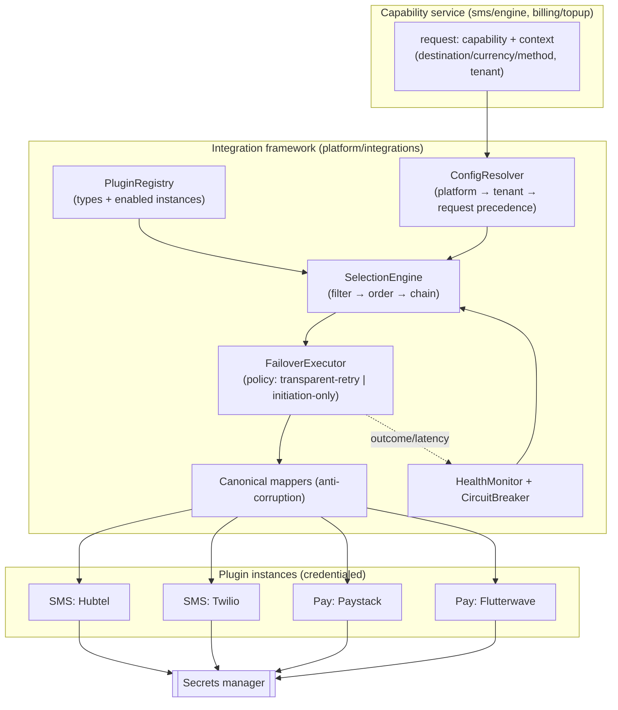
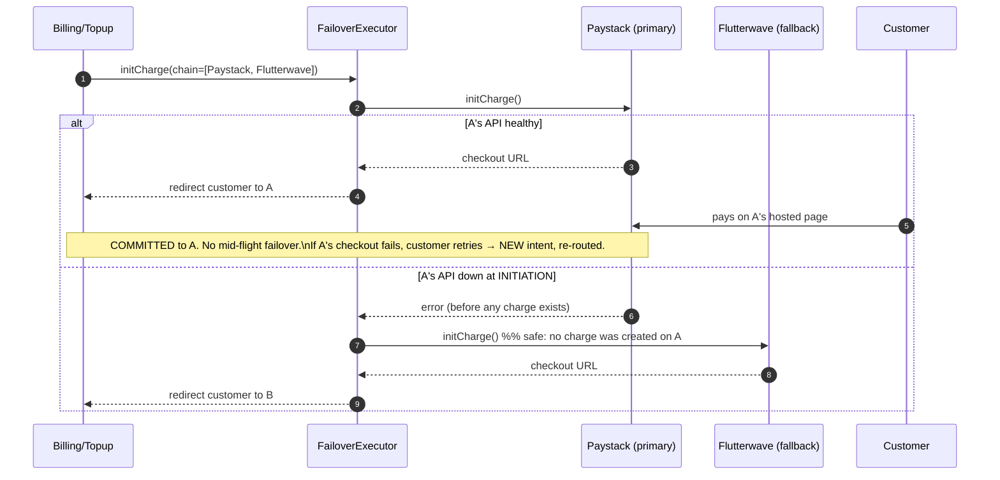
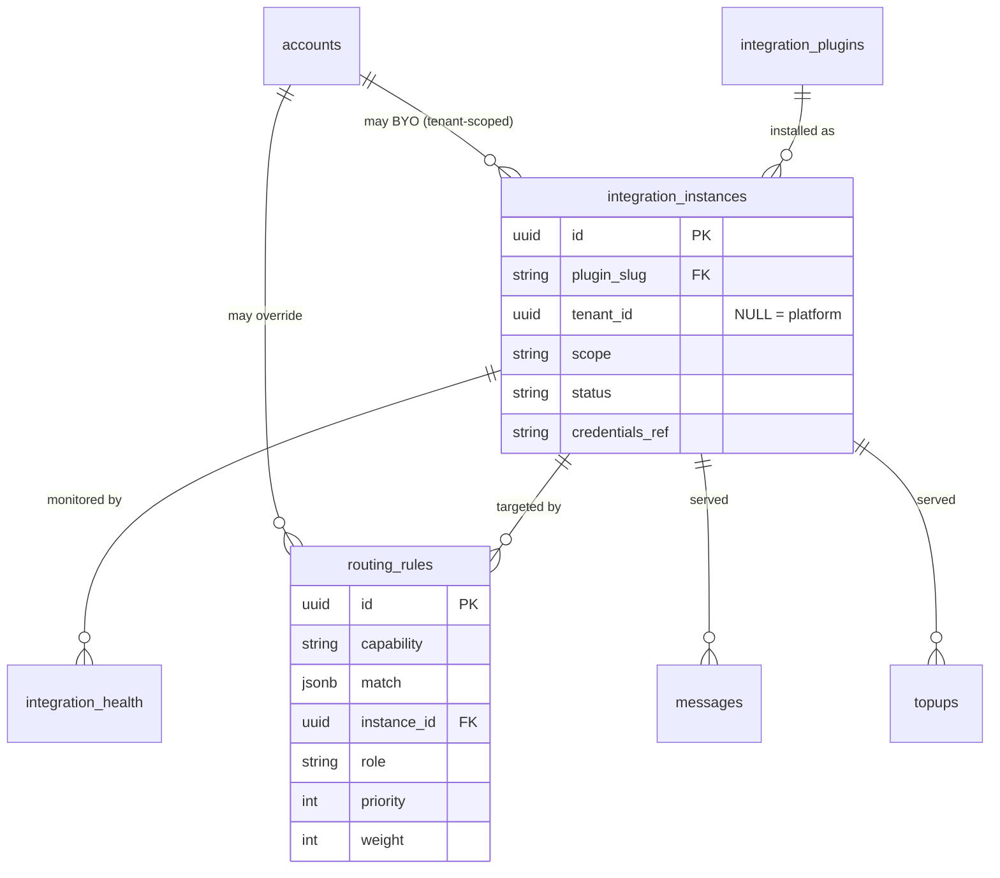
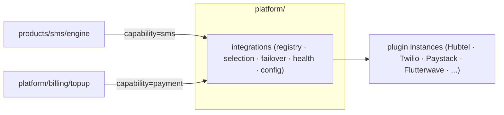

# Integrations Plugin Architecture + Resolved Schema Decisions

**Status:** Design v1 · **Date:** 2026-05-31 · **Companion to:** `ARCHITECTURE.md`, `MODULE-DECOMPOSITION.md`

This resolves the four open questions from the architecture docs. Three were reframed by the
team into a stronger requirement: **vendor-agnostic, hot-swappable provider plugins** (for SMS
*and* payments, and future capabilities) with **enable/disable**, a **default**, and
**fallback chains** — no lock-in. The fourth (currency) was set to **multi-currency from day
one**, and message-body retention was resolved by competitor research.

| Open question | Resolution |
|---|---|
| First SMS provider | **Plugin framework** — providers are pluggable; pick the first *instance* at config time, not in code (§1–§6) |
| Payment provider | **Same framework**, different failover semantics (§5 — this is the subtle part) |
| Persist message bodies? | **Store by default, encrypted, opt-in redaction (account + per-message), time-bound retention** — matches Twilio/Plivo/Bird (§8) |
| Currency model | **Multi-currency from day one** (§7) |

---

## 0. The one principle that prevents lock-in

> **Share the *mechanism*, not the *contract*.**
> The selection / failover / health / config machinery is identical across SMS, payments, and
> future capabilities — that's genuinely shared. The *vendor contract* ("send an SMS" vs
> "charge a card") is not — each capability defines its own plugin interface. We build one
> generic framework parameterized by per-capability contracts. The core never sees a
> vendor-specific shape; every adapter maps to/from canonical models (anti-corruption layer).

This also reconciles with `ARCHITECTURE.md`'s "earn the shared core" rule: the framework is a
legitimate shared abstraction because failover logic is provably identical across domains —
we're not guessing at a shape, we're factoring out a mechanism we need twice immediately.

---

## 1. Concepts: plugin *type* vs *instance*

| Term | Meaning | Example |
|---|---|---|
| **Capability** | A domain of integration with its own contract + failover policy | `sms`, `payment`, (future) `email`, `push` |
| **Plugin type** | The adapter *code* implementing a capability's contract | "Hubtel SMS adapter", "Paystack payment adapter" |
| **Plugin instance** | A *configured, credentialed activation* of a type | "Hubtel-Ghana (platform)", a tenant's own Twilio account |
| **Routing rule** | Which instance serves which request, in what order | "GH MoMo top-ups → Paystack primary, Hubtel fallback" |

Enable/disable and default/fallback operate on **instances**, not code. You can run **two
instances of the same type** (e.g. two Twilio accounts for load-splitting). Adding a brand-new
vendor = ship a plugin type + create an instance + enable it. **No core changes.**

---

## 2. Framework components



- **PluginRegistry** — knows installed plugin types and enabled instances per capability/scope.
- **ConfigResolver** — merges platform defaults ← tenant overrides ← per-request hint.
- **SelectionEngine** — filters eligible instances, orders them, returns a `[primary, …fallbacks]` chain.
- **HealthMonitor + CircuitBreaker** — per-instance rolling health; opens a circuit to auto-skip a sick instance.
- **FailoverExecutor** — runs the chain under the **capability's failover policy** (§5).
- **Canonical mappers** — each plugin translates vendor ⇄ canonical models, so the core stays vendor-blind.

---

## 3. Plugin contracts (one per capability)

```ts
// Generic base — every plugin declares what it is and what it can do.
interface PluginManifest {
  slug: string;                 // 'hubtel-sms', 'paystack'
  capability: 'sms' | 'payment';
  version: string;
  supports(ctx: RequestContext): boolean;   // country/currency/method/sender-id eligibility
  configSchema: JSONSchema;     // required keys → drives dashboard config UI + validation
  healthCheck(): Promise<HealthState>;
}

// SMS capability contract
interface SmsSenderPlugin extends PluginManifest {
  capability: 'sms';
  // How THIS provider bills US → we bill the customer on the same basis (honest, margin-safe).
  billableStatuses: MessageStatus[];        // statuses this provider charges us for (e.g. ['accepted','delivered'])
  platformFaultExemptions: string[];        // failure causes we are NEVER charged for / never charge the customer:
                                            //   internal_error · suspension · fraud_block · geo_block (Twilio-style)
  send(msg: NormalizedMessage, creds: Creds): Promise<ProviderResult>;  // → provider ref id
  parseDlr(payload: unknown): CanonicalDlr;
  verifyWebhook(req: IncomingRequest, creds: Creds): boolean;
}

// Payment capability contract
interface PaymentProviderPlugin extends PluginManifest {
  capability: 'payment';
  initCharge(intent: TopupIntent, creds: Creds): Promise<CheckoutSession>; // hosted URL / ref
  parseEvent(payload: unknown): CanonicalPaymentEvent;                      // succeeded/failed
  verifyWebhook(req: IncomingRequest, creds: Creds): boolean;
  refund(ref: string, amountMinor: bigint, creds: Creds): Promise<RefundResult>;
}
```

Canonical models (`NormalizedMessage`, `CanonicalDlr`, `CanonicalPaymentEvent`, canonical
status enums) are the only shapes the core handles. **Lock-in is impossible** because removing
a vendor = deleting its adapter; nothing else references it.

> **`billableStatuses` + `platformFaultExemptions` drive wallet commit/refund timing** (honest-billing
> model, see `SMS-FEATURES-AND-POSITIONING.md §5.A`). The engine always **reserves** on send, then:
> - **platform-fault failure** (in `platformFaultExemptions`: internal error / suspension /
>   fraud-block / geo-block) → **refund** — the customer is *never* charged for failures we caused;
> - message reaches a status in **`billableStatuses`** (the provider charges us) → **commit**,
>   mirroring exactly what the provider bills us;
> - otherwise (non-billable terminal status) → **refund**.
>
> So the customer is billed on the **same basis the provider bills us**, minus our own faults →
> no phantom charges, no margin gap. A "guaranteed-delivered" premium tier may narrow
> `billableStatuses` to `['delivered']` on trustworthy routes, priced ≥ `cost ÷ delivery_rate`.
>
> **Refined 2026-06-02 (PI-1 research):** replaced the binary `billingBasis: submission|delivered`
> with a billable-status set + platform-fault exemptions, because real providers (Twilio bills
> `undelivered` + a `failed` fee but exempts its own faults; Termii bills at submission) aren't a
> clean binary. Principle: **never charge for failures *we* caused** — not "never charge for failures."

---

## 4. Selection engine — default + fallback

For a given request the engine produces an ordered chain:

```
1. FILTER   enabled instances for this capability
            ∩ supports(ctx)  (country/currency/method/sender-id)
            ∩ tenant-entitled (plan/BYO)
            ∩ circuit CLOSED (healthy)
2. ORDER    by routing rule: priority → weight (load-split/canary) → cost → latency
3. CHAIN    [primary, fallback#1, fallback#2, ...]
```

- **Default** = highest-priority eligible instance.
- **Weighting** enables load-balancing and canary rollouts of a new vendor (e.g. 90/10).
- **Cost-aware routing** (least-cost routing) and **health** break ties / demote sick vendors.

---

## 5. Failover semantics — ★ the subtlety that matters

**This is the part to get right. SMS failover and payment "failover" are NOT the same, and
treating them identically causes double-charges.** Failover policy is a property of the
capability.

### 5.1 SMS → `TRANSPARENT_RETRY`
A send is idempotent at the recipient level — the user gets one SMS regardless of which gateway
delivered it. So on failure we may transparently advance to the next instance in the chain.

```mermaid
sequenceDiagram
    autonumber
    participant E as SmsEngine
    participant X as FailoverExecutor
    participant A as Hubtel (primary)
    participant B as Twilio (fallback)
    E->>X: send(chain=[Hubtel, Twilio], idem-key)
    X->>A: send()
    alt hard failure (conn error / explicit reject)
        A-->>X: error
        X->>B: send()   %% transparent retry on next instance
        B-->>X: accepted (provider_ref)
    else ambiguous (timeout, no response)
        A-->>X: timeout
        Note over X: DO NOT blindly failover — A may have accepted.\nMark 'unknown', reconcile via DLR; retry only if DLR confirms no-send.
    end
    X-->>E: result + served_by instance
```

- Failover **only on unambiguous failure** (connection refused, explicit reject, 5xx).
- On **timeout/unknown**, do **not** blindly re-send (risk: double-send) — mark unknown and let
  DLR reconciliation decide. The wallet reservation (from `ARCHITECTURE.md §5`) is held until
  resolved, then committed once or refunded.
- A per-attempt provider idempotency key + final accept-once dedup prevents duplicates.

### 5.2 Payment → `INITIATION_ONLY`
You must **never** silently re-attempt a charge on provider B after provider A may have charged
the customer — double-charge + the customer is mid-checkout on a hosted page.



- Failover happens **only at initiation**, before any charge exists. Once a checkout/charge is
  created, that attempt is **bound** to that provider.
- "Multiple with default + fallback" for payments mostly means **method/currency/country
  routing** (card → Stripe, GH MoMo → Hubtel/Paystack) + initiation-time health failover.
- A failed/abandoned payment → the **customer** starts a *new* top-up intent, which re-routes.
- The `topups` row records `provider_instance_id` so reconciliation knows who owns the money.

| | SMS | Payment |
|---|---|---|
| Failover policy | `TRANSPARENT_RETRY` | `INITIATION_ONLY` |
| Retry in-flight? | Yes, on hard failure only | **Never** after charge exists |
| On ambiguity | Mark unknown, reconcile via DLR | Treat as bound; customer re-initiates |
| Routing driver | cost / health / sender-id | method / currency / country / health |

---

## 6. Configuration & precedence (enable/disable, BYO credentials)

```
Per-request hint   (force a specific instance — testing/advanced)   ── highest
        ▼
Tenant config      (prefer/disable instances, bring-your-own creds, plan entitlement)
        ▼
Platform defaults  (which instances exist, global routing rules)    ── lowest
```

- **Enable/disable** = flip an instance's `status` (hot, cached, no redeploy).
- **Bring-your-own (BYO)**: a tenant supplies their own Twilio/Paystack account → a tenant-scoped
  instance with the tenant's credentials. Their traffic routes through it; billing/markup rules
  still apply.
- **Entitlement**: plan gating decides which instances/capabilities a tenant may use.

> **Who authors this config?** The **platform-defaults** rung (which instances exist, global
> routing rules, kill-switches, entitlement bounds) is authored by the **control plane / admin
> system** (`CONTROL-PLANE-ADMIN.md`), with validation, versioning, and audit. The
> **tenant-config** rung is the customer self-service plane, bounded by those entitlements. This
> precedence ladder **is** the control-plane→tenant delegation model. The SelectionEngine (and
> the rest of the data plane) only ever **reads** this config from a cached, last-known-good
> store — it never calls the control plane per request, so sends keep working if the admin
> system is down.

---

## 7. Multi-currency money model (resolved: from day one)

Multi-currency reshapes the wallet/ledger/pricing from `ARCHITECTURE.md §5` and
`MODULE-DECOMPOSITION.md §3.3–3.4`:

```sql
-- One wallet PER (tenant, currency). A tenant may hold GHS, NGN, USD wallets.
wallets(id, tenant_id, currency char(3), balance_minor bigint, version, status,
        UNIQUE(tenant_id, currency))

-- Ledger carries currency (inherited from its wallet). A transaction stays within ONE currency.
ledger_transactions(id, tenant_id, currency, type, status, idempotency_key, metadata, created_at)
ledger_entries(id, tenant_id, txn_id, wallet_id, currency, direction, amount_minor, reason, ...)

-- Pricing is per currency per destination.
price_lists(id, tenant_id NULLABLE(global), product, country/prefix,
            currency char(3), unit, price_minor, effective_from)

-- Top-ups specify currency → credit the matching-currency wallet.
topups(id, tenant_id, wallet_id, amount_minor, currency, provider_instance_id, ...)

-- FX placeholder (NOT used at launch; reserved so cross-currency is a feature, not a migration)
fx_rates(base char(3), quote char(3), rate numeric, as_of)
```

**Enabled currencies are CONTROL-PLANE CONFIG, not code (resolved 2026-06-02):**
- The set of **supported currencies + a default** is platform config managed in the admin
  console (`CONTROL-PLANE-ADMIN.md §4.1`), optionally narrowed per tenant via entitlement.
  Wallet creation, pricing, and top-ups **validate against this configured set**.
- **At launch the operator enables one currency** (e.g. GHS). Adding NGN/USD later is a
  **config change — no migration, no deploy** (the schema is already multi-currency).
- We therefore build the multi-currency machinery (per-currency wallet resolution + per-currency
  pricing); only the *active set* is configured. This is barely more than single-currency since
  the schema is already keyed by currency — and it avoids a future refactor.

**Launch rules (keep it correct, defer FX):**
- A tenant has a **billing currency** per product/route; sends are priced and charged in that
  currency, debiting the matching-currency wallet.
- **No implicit FX at launch:** if a tenant lacks a wallet in the pricing currency, the action
  is rejected with a clear error (or they top up that currency). FX conversion is a later
  feature; the `fx_rates` table + `currency` columns mean it's additive, not a rebuild.
- **Each ledger transaction is single-currency.** Cross-currency (FX) is modeled later as two
  transactions linked by an FX record — never mixed legs.
- **Payment routing is currency-aware** (§4 filter): an NGN top-up only routes to instances
  whose `supports()` includes NGN.

---

## 8. Message-body retention (resolved, with competitor evidence)

Decision: **store bodies by default, encrypted at rest, with opt-in redaction (account +
per-message) and a time-bound retention window then purge/archive.** This is the union of what
the market ships:

| Provider | Default | Privacy control | Retention |
|---|---|---|---|
| **Twilio** | stores body | opt-in redaction `ContentRetention=discard` (account + per-message); unredacted ≤24h | 13 months in console/API, then archive |
| **Plivo** | logs content (`log=true`) | opt-in redaction per-app (inbound) / per-request (`log=false`) | — |
| **Bird** | stores content | — | purged after 6 months |

### Schema impact on `messages`
> **Reconciled with PII tokenization (`COMPLIANCE-AND-DATA-PROTECTION.md §5`):** the body is **not**
> a column on `messages`. The raw body lives **only** in the encrypted `pii_vault`; `messages`
> holds a nullable **`body_ref → pii_vault`**. "Redact / opt-out" = no vault entry (`body_ref` NULL);
> "erasure" = crypto-shred the subject's DEK; "retention purge" = delete the vault row + null the ref.
```sql
messages(
  ...,
  to_subject_id  uuid → data_subjects,   -- recipient (PII tokenized; never a raw number column)
  body_ref       uuid → pii_vault NULL,   -- NULL when redacted / opt-out / purged / erased
  body_redacted  boolean default false,
  retain_until   timestamptz,            -- purge job deletes the vault row + nulls body_ref after
  ...
)

-- tenant-level default + per-message override
account_settings(tenant_id, store_message_bodies boolean default true,
                 body_retention_days int default 180)   -- Bird-like default; configurable
-- per-message override: send API accepts redact=true → no vault entry is written for the body
```

- **Default ON** (you need it for support, delivery troubleshooting, and history).
- **Account-level opt-out** (`store_message_bodies=false`) → bodies never written to the vault.
- **Per-message `redact=true`** for one-off sensitive sends (OTP, etc. — recommend redacting OTP bodies always).
- **Retention purge job** deletes the `pii_vault` body row + nulls `body_ref` after `retain_until`
  (default 180 days, configurable), keeping message metadata (status, cost, segments) for billing/analytics.
- **Encrypted at rest** in the vault; **erasable in one op** by destroying the subject's DEK.

---

## 9. New / changed entities (integration framework)

Replaces the earlier `providers`, `provider_credentials`, `provider_health`, `routing_rules`
with a capability-generic set (SMS-specific `sender_ids` stays in the SMS domain).

```sql
integration_plugins(slug PK, capability, version, manifest jsonb, status)   -- installed types

integration_instances(id, plugin_slug→integration_plugins,
                      tenant_id NULLABLE(platform-scoped), name,
                      scope[platform|tenant], status[enabled|disabled],
                      credentials_ref(secret), config jsonb, created_at)

routing_rules(id, capability, tenant_id NULLABLE(global),
              match jsonb,                 -- {country, currency, method, sender_id?}
              instance_id→integration_instances,
              role[primary|fallback], priority, weight, enabled)

integration_health(instance_id→integration_instances, window,
                   error_rate, p95_latency_ms, circuit_state[closed|open|half_open], updated_at)

-- attribution: who actually served the request (added to domain rows)
-- messages.provider_instance_id  → integration_instances
-- messages.routing_attempts jsonb (the tried chain + outcomes)
-- topups.provider_instance_id    → integration_instances
```



---

## 10. Module impact

- `products/sms/providers` + `products/sms/routing` are **subsumed** by a new shared
  **`platform/integrations`** module (registry, selection, failover, health, config). SMS-specific
  bits (`sender_ids`, DLR parsing) stay in the SMS domain as the SMS plugin contract.
- `billing/topup` now calls `platform/integrations` with capability `payment` instead of a
  hardcoded provider.
- This *is* a shared-core capability — and a justified one (the mechanism is needed twice now).



---

## 10b. Future: vertical integration — replacing vendors with our own systems

**Strategic intent (captured 2026-06-02):** once we have a strong customer base, we roll out our
**own** SMS gateway (direct carrier/SMPP connections) and, later, our own payment rails —
replacing the third-party vendors. **This framework is what makes that a migration, not a
rewrite.** Our own systems are simply **new plugin instances**:

1. Build `inhouse-smpp` (or `inhouse-pay`) implementing the **same** `SmsSenderPlugin` /
   `PaymentProviderPlugin` contract.
2. Register it as a **platform-scoped instance** (the `scope: platform` we already model).
3. **Shift traffic gradually** via routing weights — canary 5%→25%→100%, and/or **per-country**
   (self-serve where we have carrier deals; external vendors elsewhere).
4. **Keep external vendors as `fallback`** even after cutover → our new gateway's early hiccups
   never drop a message. De-risks the migration.
5. **Least-cost routing** then prefers our cheaper in-house route automatically.

The engine, wallet, billing, DLR, and dashboards **do not change**. We launch *as a reseller on
aggregators* (fast, no carrier contracts) and become *the infrastructure* as volume justifies it.

**Constraints to remember:**
- **Volume-gated margin play.** Direct carrier/SMPP carries high fixed cost (carrier contracts,
  SMPP infra, 24/7 NOC, possible telco licensing); only beats aggregators above a volume
  threshold. Build it when the economics close, not before (the "earn it" principle).
- **SMS self-rollout ≪ payments self-rollout.** Payments self-rollout is heavily regulated
  (PSP/EMI licensing, PCI-DSS, settlement, central-bank approval) — a far bigger, slower lift;
  likely licensed/partnered before fully built.
- **Keep the plugin contract transport-agnostic.** Our own gateway will likely be **SMPP**
  (persistent sessions, async `submit_sm`/`deliver_sm`), not HTTP. The contract already allows
  this (the adapter encapsulates the session, maps to canonical DLR) — **don't leak HTTP-isms
  into the core**, or the SMPP adapter gets awkward.

**Do now to enable it later:** **retain rich per-route history** — delivery %, latency, cost,
cost-per-delivered, per carrier (via `integration_health` + DLR reconciliation). That data is
what proves the economics, picks which routes to self-serve first, and arms carrier negotiations.

---

## 11. Updated decisions log (appends to ARCHITECTURE.md §12)

| # | Decision | Rationale |
|---|---|---|
| 7 | Vendor-agnostic plugin framework (share mechanism, not contract) | No lock-in; reuse across SMS/payments/future |
| 8 | Per-capability failover policy: SMS `TRANSPARENT_RETRY`, payment `INITIATION_ONLY` | Prevents double-charge; correct retry semantics |
| 9 | Multi-currency from day one; single-currency per ledger txn; FX deferred | Team requirement; schema additive for FX |
| 10 | Store message bodies by default, encrypted, opt-in redaction, time-bound retention | Matches Twilio/Plivo/Bird; preserves support/debugging |
| 11 | Plugin *instances* (configured+credentialed) vs *types* (code); BYO credentials per tenant | Enables enable/disable, multi-account, tenant BYO |

---

## Sources (message-body research)
- Twilio — Message Redaction: https://www.twilio.com/docs/messaging/guides/privacy-message-redaction
- Twilio — SMS message & traffic storage: https://help.twilio.com/articles/223181008-Twilio-SMS-message-and-traffic-storage
- Twilio — Data Retention & Deletion: https://help.twilio.com/articles/4410585868443-Data-Retention-and-Deletion-in-Twilio-Products
- Plivo — SMS Data Redaction: https://www.plivo.com/docs/messaging/concepts/sms-data-redaction
- Bird (MessageBird) — Data retention strategy: https://docs.bird.com/connectivity-platform/data-governance-and-security/what-is-messagebirds-data-retention-strategy
