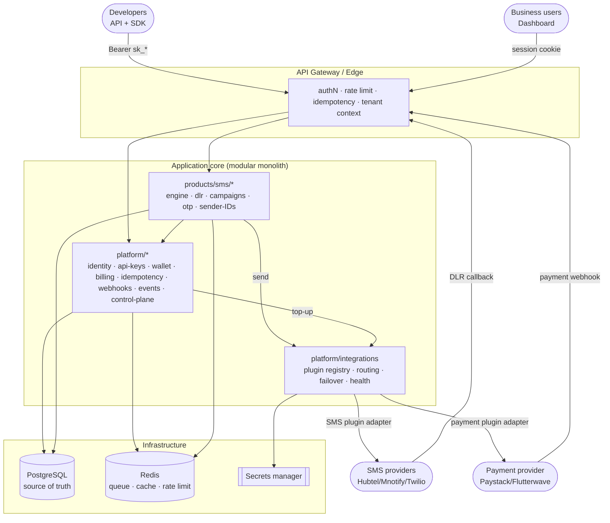
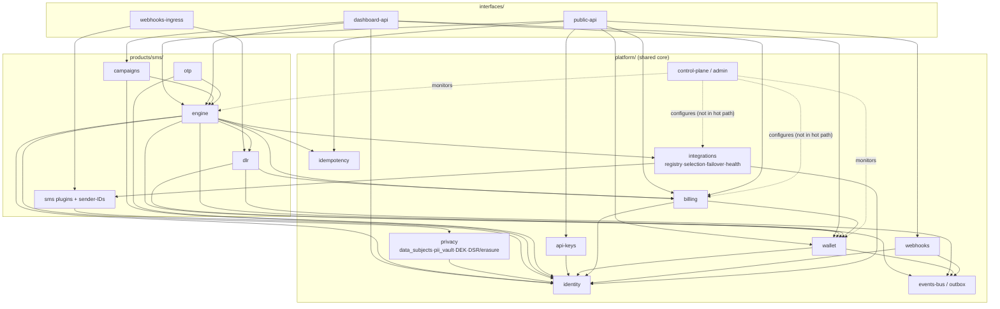
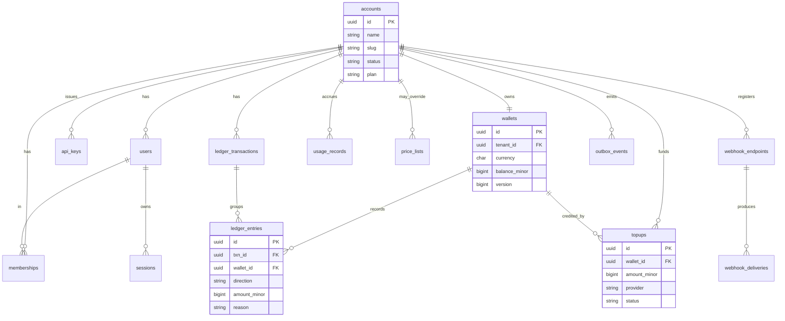
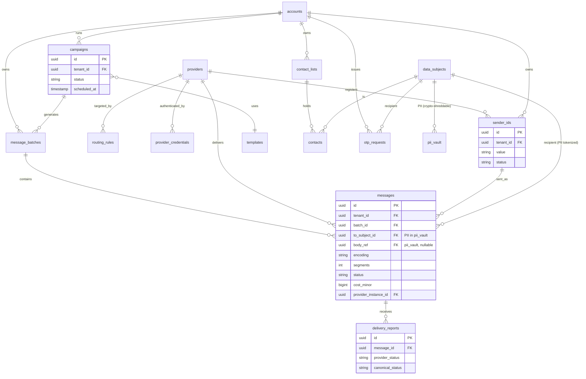
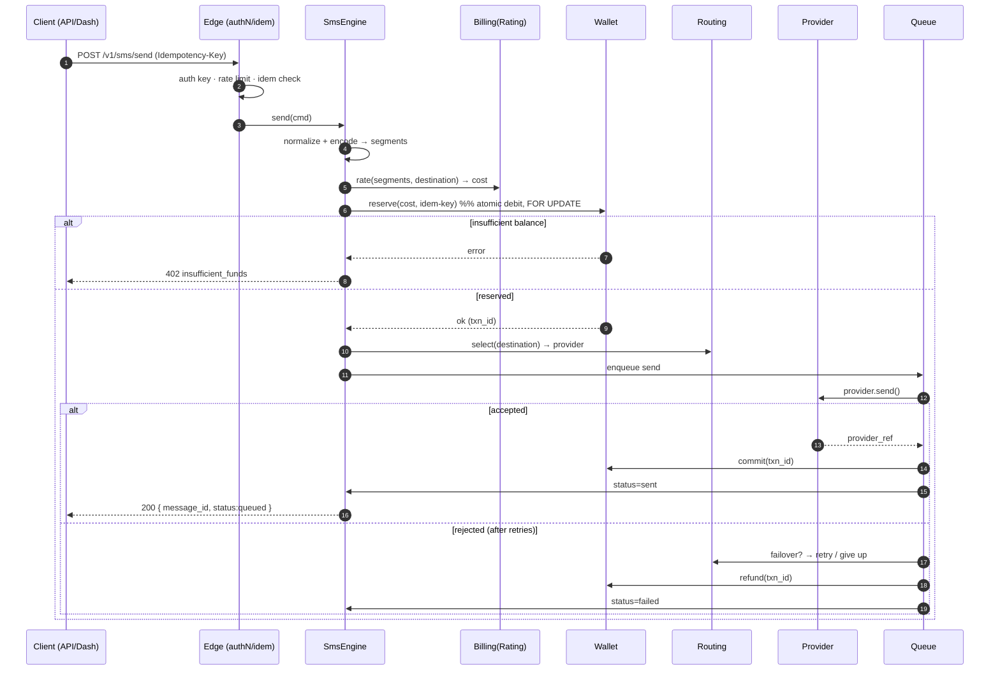
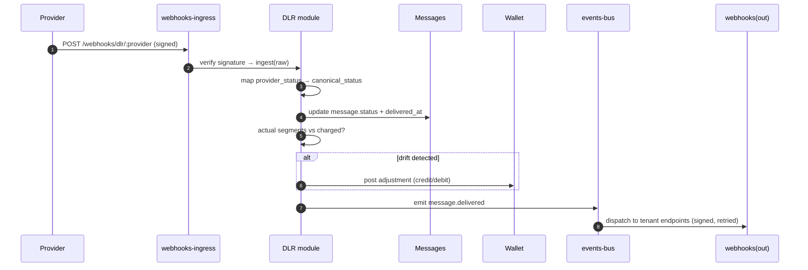
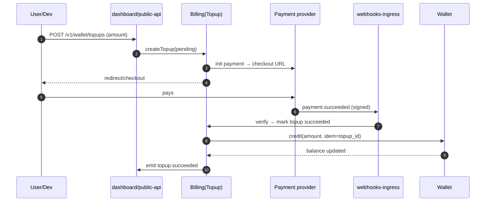
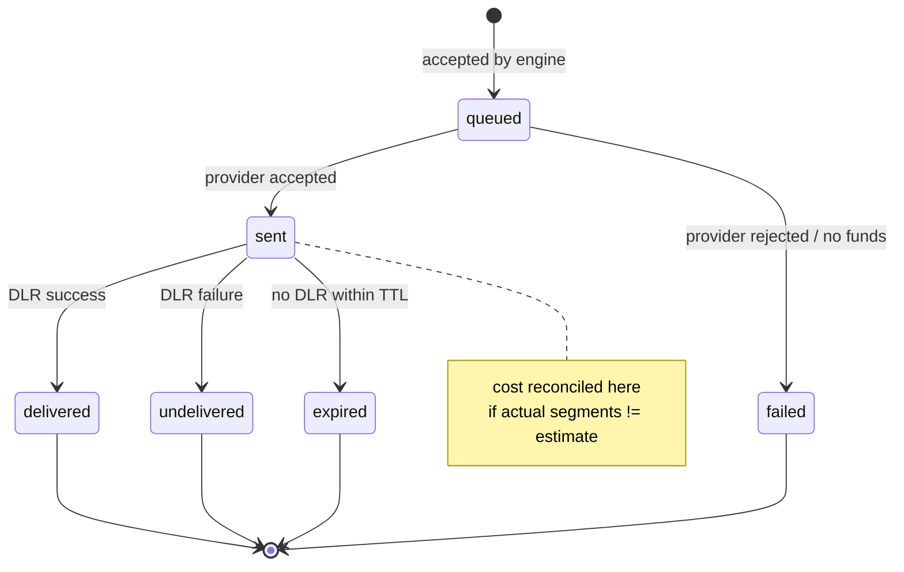

# Module Decomposition, Entities & Dependencies

**Status:** Design v1 · **Date:** 2026-05-31 · **Companion to:** `ARCHITECTURE.md`

This document decomposes every module into its **components**, the **entities (tables)**
it owns, its **dependencies** (who it may call), and the **domain events** it emits or
consumes. Diagrams are Mermaid (render in VS Code / JetBrains / GitHub).

**Two hard rules govern every dependency below:**
1. `products/*` may depend on `platform/*`. `platform/*` must **never** depend on `products/*`.
2. A module reads/writes **only its own tables**. Cross-module data is reached through the
   owning module's service interface or via domain events — never by a foreign `JOIN` into
   another module's tables.

---

## 1. Container / context diagram (C4-ish)



> **The app never calls a vendor directly.** Sends and top-ups go through
> `platform/integrations`; only the **provider plugin adapter** (inside integrations) makes the
> outbound call — which is what enables failover, no-lock-in, and per-provider `billingBasis`.

---

## 2. Module dependency graph

Arrows mean **"depends on / may call"**. Note nothing points *out of* products into the
interfaces, and nothing in platform points into products.



> `routing` + `providers` (the original SMS sub-modules) are **superseded** by
> `platform/integrations` + the SMS plugin contract — see §4.2/§4.3 notes below.

---

## 3. Platform-core decomposition

> **Two further platform-core module groups are specified in their own docs** (added after this
> doc was first written) and are part of the shared core:
> - **`platform/integrations`** — vendor-plugin framework (registry · selection · failover ·
>   health · config). Subsumes the SMS `routing`/`providers` modules below into a shared,
>   capability-generic mechanism. See `INTEGRATIONS-PLUGIN-ARCHITECTURE.md`.
> - **`platform/privacy`** — PII tokenization + data protection: owns `data_subjects` (the
>   `subject_id` surrogate), `pii_vault` (encrypted phone/body/attributes), per-subject DEKs, and
>   **DSR/erasure** (erasure = crypto-shred the DEK). Every other module references `subject_id`,
>   never raw PII. See `COMPLIANCE-AND-DATA-PROTECTION.md §5–§6`.
> - **`platform/control-plane`** — the internal **Admin / Control Plane** (`staff-iam`, `config`,
>   `audit`, `entitlements`, `product-registry`, `observability`, `ops`). Centralized day one;
>   owns/edits all platform config; consumes telemetry; never in the data-plane hot path.
>   Full component + entity decomposition in **`CONTROL-PLANE-ADMIN.md §11–§12`**.
>   Note: config entities below (`routing_rules`, `price_lists`, provider instances, etc.) and
>   `account_settings` are **authored/owned by the control plane**; the data plane reads them cached.

### 3.1 `identity` — accounts, users, RBAC
| | |
|---|---|
| **Responsibility** | Owns tenants (accounts), users, sessions, role assignments. The root of tenancy. |
| **Components** | `AccountService`, `UserService`, `AuthService` (sessions/login), `RbacGuard` |
| **Depends on** | *(nothing — foundational)* |
| **Emits** | `account.created`, `user.invited`, `user.activated` |
| **Entities** | `accounts`, `users`, `memberships`, `sessions` |

```
accounts(id, name, slug, status, plan, settings jsonb, created_at)
users(id, tenant_id→accounts, email, password_hash, name, status, created_at)
memberships(id, tenant_id, user_id→users, role[owner|admin|member])
sessions(id, user_id→users, token_hash, ip, user_agent, expires_at)
```

### 3.2 `api-keys` — programmatic credentials
| | |
|---|---|
| **Responsibility** | Issue/rotate/revoke API keys, hash at rest, carry scopes + rate-limit policy. |
| **Components** | `ApiKeyService`, `ApiKeyAuthStrategy`, `ScopeGuard` |
| **Depends on** | `identity` (tenant + issuing user) |
| **Emits** | `apikey.created`, `apikey.revoked` |
| **Entities** | `api_keys` |

```
api_keys(id, tenant_id, name, prefix, key_hash, mode[live|test],
         scopes text[], rate_limit_policy, created_by→users,
         last_used_at, revoked_at, created_at)
```

### 3.3 `wallet` — balances + double-entry ledger ★ crown jewel
| | |
|---|---|
| **Responsibility** | Hold balances; record every money movement as append-only ledger legs. Reserve/commit/refund. |
| **Components** | `WalletService` (reserve/commit/refund/credit), `LedgerRepository` (append-only), `BalanceProjector`, `InvariantChecker` (job) |
| **Depends on** | `identity` (tenant), `events-bus` |
| **Emits** | `wallet.debited`, `wallet.credited`, `wallet.low_balance` |
| **Entities** | `wallets`, `ledger_transactions`, `ledger_entries` |

```
wallets(id, tenant_id, currency, balance_minor bigint, version, status)
ledger_transactions(id, tenant_id, type[topup|sms_charge|adjustment|refund],
                    status, idempotency_key, metadata jsonb, created_at)
ledger_entries(id, tenant_id, txn_id→ledger_transactions, wallet_id→wallets,
               direction[credit|debit], amount_minor bigint(>0),
               reason, reference_type, reference_id, created_at)
-- UNIQUE(tenant_id, idempotency_key) on ledger_transactions
-- INVARIANT: per wallet, SUM(credits) - SUM(debits) = balance_minor
```

### 3.4 `billing` — pricing, rating, usage, payments
| | |
|---|---|
| **Responsibility** | Compute cost (rating), record usage, manage price lists, drive top-ups, produce invoices. |
| **Components** | `RatingService` (segments×price), `UsageRecorder`, `PriceListService`, `TopupService`, `InvoiceService` (later) |
| **Depends on** | `identity`, `wallet` (instructs credits/debits) |
| **Emits** | `usage.recorded`, `topup.succeeded`, `topup.failed`, `invoice.issued` |
| **Entities** | `price_lists`, `usage_records`, `topups`, `invoices` |

```
price_lists(id, tenant_id NULLABLE(global), product, country/prefix, unit,
            price_minor, currency, effective_from)
usage_records(id, tenant_id, product, reference_id, quantity, unit_price_minor,
              total_minor, created_at)
topups(id, tenant_id, wallet_id→wallets, amount_minor, provider,
       provider_ref, status[pending|succeeded|failed], created_at)
invoices(id, tenant_id, period_start, period_end, total_minor, status)  -- later
```

### 3.5 `idempotency` — exactly-once for money/sends
| | |
|---|---|
| **Responsibility** | Store request fingerprints + cached responses; serialize retries of the same key. |
| **Components** | `IdempotencyInterceptor`, `IdempotencyStore` (Redis + Postgres durable) |
| **Depends on** | *(infra; used by interfaces, engine, wallet)* |
| **Entities** | `idempotency_keys` |

```
idempotency_keys(key, tenant_id, request_hash, response_snapshot jsonb,
                 status[in_progress|done], locked_at, created_at, expires_at)
-- UNIQUE(tenant_id, key)
```

### 3.6 `webhooks` — signed outbound delivery
| | |
|---|---|
| **Responsibility** | Tenant-registered endpoints; deliver domain events with HMAC signing + retries. |
| **Components** | `EndpointService`, `DeliveryDispatcher` (queue), `SignatureSigner` |
| **Depends on** | `identity`, `events-bus` |
| **Consumes** | every `*.*` domain event a tenant subscribed to |
| **Entities** | `webhook_endpoints`, `webhook_deliveries` |

```
webhook_endpoints(id, tenant_id, url, secret, events text[], status, created_at)
webhook_deliveries(id, tenant_id, endpoint_id→webhook_endpoints, event_type,
                   payload jsonb, status, attempts, next_retry_at,
                   last_response_code, created_at)
```

### 3.7 `events-bus` — transactional outbox
| | |
|---|---|
| **Responsibility** | Reliable in-process domain events via the outbox pattern (write event + state in one txn, relay async). |
| **Components** | `EventPublisher`, `OutboxRelay` (poller), `EventHandlerRegistry` |
| **Depends on** | *(foundational)* |
| **Entities** | `outbox_events` |

```
outbox_events(id, tenant_id, type, aggregate_type, aggregate_id,
              payload jsonb, occurred_at, published_at NULL)
```

---

## 4. SMS-product decomposition

### 4.1 `engine` — send orchestration
| | |
|---|---|
| **Responsibility** | The single send path. Normalize → encode/segment → rate → reserve → route → dispatch → commit/refund. |
| **Components** | `SmsEngine` (orchestrator), `NumberNormalizer` (E.164), `EncoderSegmenter` (GSM-7/UCS-2), `SendDispatcher` (BullMQ) |
| **Depends on** | `identity`, `routing`, `providers`, `dlr`, `wallet`, `billing`, `idempotency`, `events-bus` |
| **Emits** | `message.queued`, `message.sent`, `message.failed` |
| **Entities** | `message_batches`, `messages` |

```
message_batches(id, tenant_id, campaign_id NULL, source[api|dashboard],
                total, created_by, created_at)
messages(id, tenant_id, batch_id→message_batches, to_subject_id→data_subjects, sender_id→sender_ids,
         body_ref→pii_vault NULL, encoding[gsm7|ucs2], segments, status, cost_minor,
         -- raw recipient number + body live ONLY in pii_vault (crypto-shreddable); see COMPLIANCE doc §5
         provider_id→providers, provider_ref, error_code, idempotency_key,
         created_at, sent_at, delivered_at)
```

### 4.2 `routing` — ⛔ SUPERSEDED by `platform/integrations`
> Provider selection, routing rules, and failover are now part of the shared
> **`platform/integrations`** framework (`INTEGRATIONS-PLUGIN-ARCHITECTURE.md §2,§4,§5`), not an
> SMS-specific module. `routing_rules` is generalized (capability-keyed) and `provider_health`
> became `integration_health`. **Do not build a separate SMS routing module.**

### 4.3 `providers` — folded into the SMS plugin contract + `platform/integrations`
| | |
|---|---|
| **Responsibility** | The SMS-specific part that **remains** in the SMS domain: the `SmsSenderPlugin` adapters and **sender-ID** registration/approval. Provider *registry, credentials, instances, health* are owned by `platform/integrations` (`integration_plugins`, `integration_instances`). |
| **Components** | `SmsSenderPlugin` adapters (Hubtel/mNotify/Twilio…), `SenderIdService` |
| **Depends on** | `platform/integrations`, `identity`, secrets manager (via integrations) |
| **Emits** | `sender_id.approved`, `sender_id.rejected` |
| **Entities (SMS-owned)** | `sender_ids` |

```
-- SMS-owned. Provider instances/credentials live in platform/integrations (integration_instances).
sender_ids(id, tenant_id, value, provider_instance_id→integration_instances,
           status[pending|approved|rejected], created_at)
```

> **Note for the ERD/§4.1:** `messages.provider_id→providers` should read
> `messages.provider_instance_id→integration_instances` (per `INTEGRATIONS…md §9`).

### 4.4 `dlr` — delivery reports & reconciliation
| | |
|---|---|
| **Responsibility** | Ingest provider callbacks, map to canonical status, update message, reconcile cost vs. actual segments. |
| **Components** | `DlrIngestor`, `StatusMapper`, `Reconciler` (posts wallet `adjustment`) |
| **Depends on** | `engine` (messages), `wallet`, `billing`, `events-bus` |
| **Emits** | `message.delivered`, `message.undelivered` |
| **Entities** | `delivery_reports` |

```
delivery_reports(id, tenant_id, message_id→messages, provider_id→providers,
                 provider_status, canonical_status, raw jsonb, received_at)
```

### 4.5 `campaigns` — bulk, contacts, templates (dashboard)
| | |
|---|---|
| **Responsibility** | Non-developer bulk sending: contact lists, templates, scheduling, campaign analytics. |
| **Components** | `CampaignService`, `ContactListService`, `TemplateService`, `CsvImporter`, `Scheduler` |
| **Depends on** | `engine`, `identity` |
| **Emits** | `campaign.started`, `campaign.completed` |
| **Entities** | `campaigns`, `contact_lists`, `contacts`, `templates` |

```
campaigns(id, tenant_id, name, template_id→templates NULL, sender_id→sender_ids,
          status, scheduled_at, stats jsonb, created_by, created_at)
contact_lists(id, tenant_id, name, count)
contacts(id, tenant_id, list_id→contact_lists, subject_id→data_subjects, opted_out)
         -- phone + attributes live in pii_vault keyed by subject_id (erasure = crypto-shred)
templates(id, tenant_id, name, body, variables jsonb, category)
```

### 4.6 `otp` — one-time passwords (**P1** — high-margin, fintech demand)
| | |
|---|---|
| **Responsibility** | Generate/verify OTP codes over the SMS engine. (SMS channel in P1; multi-channel fallback SMS→voice→WhatsApp is P2/P3.) Always redact OTP bodies. |
| **Components** | `OtpService` (generate/verify, attempt limits, expiry) |
| **Depends on** | `engine`, `identity` |
| **Entities** | `otp_requests` |

```
otp_requests(id, tenant_id, subject_id→data_subjects, code_hash, channel, status,
             attempts, expires_at, verified_at, created_at)
             -- recipient number in pii_vault; OTP bodies always redacted
```

---

## 5. Interfaces decomposition

| Interface | Role | Depends on | Auth |
|---|---|---|---|
| `public-api` | Versioned REST for developers (`/v1/...`) — *self-service/data* | `api-keys`, `idempotency`, `engine`, `wallet`, `billing`, `webhooks` | `Bearer sk_*` |
| `dashboard-api` | BFF for the customer dashboard — *self-service plane* | `identity`, `campaigns`, `engine`, `wallet`, `billing` | WorkOS SSO session + tenant RBAC |
| `admin-api + admin-console` | **Control plane** — staff configure/monitor/govern all products. **Isolated deployable**, separate auth + ingress | `control-plane/*` (governs platform + products) | **staff IdP** + admin RBAC + step-up |
| `webhooks-ingress` | Inbound provider DLRs + payment callbacks | `dlr`, `providers` (verify sig), `billing` (topups) | signature verification |

Interfaces hold **no business logic** — they validate, resolve tenant/staff context, and
delegate to module services. The `admin-console` is the **control plane** — never in the data
plane's hot path (it writes config + consumes telemetry; the data plane reads cached config).

---

## 6. Entity-Relationship Diagram — Platform core



---

## 7. Entity-Relationship Diagram — SMS product



---

## 8. Sequence — Send SMS (the money path)



---

## 9. Sequence — DLR ingestion & reconciliation



---

## 10. Sequence — Wallet top-up



---

## 11. Message lifecycle state machine



---

## 12. Build order implied by dependencies (topological)

Because dependencies point downward, build in this order so nothing is mocked for long:

```
0. WorkOS env + staff-iam + audit   (identity providers; audit is cross-cutting from day one)
1. identity              (root: accounts, users-by-sub, memberships) + data_region on tenants
1b. privacy             (data_subjects + pii_vault + per-subject DEK / crypto-shred) — MUST precede any PII-bearing table
2. events-bus, idempotency (infra primitives)
3. api-keys              (needs identity)
4. wallet                (needs identity, events)  — multi-currency machinery, enabled set via config
5. billing               (needs wallet)
6. integrations          (registry · selection · failover · health · config — replaces providers+routing)
7. sms providers/plugins (SMS adapters + sender-IDs, under integrations)
8. sms/engine            (needs wallet, billing, integrations, idem, events)
9. dlr                   (needs engine, wallet, billing)
10. webhooks(out)        (needs events)
11. public-api           (wires the above)
12. control-plane/admin-console  (config authoring + monitoring over the above; minimal CRUD P1)
13. campaigns → dashboard-api    (Phase 2)
11b. otp (P1 — SMS channel; sits on the engine + wallet, like a constrained send)
14. multi-channel OTP fallback, advanced routing/failover, entitlements UI (Phase 3)
```

> Note vs the original list: `providers`+`routing` collapsed into `integrations` (step 6–7);
> `audit`/`staff-iam` moved to step 0 (cross-cutting); `control-plane` console added at step 12.
> The control plane is built *over* a working data plane — it governs what already runs.
