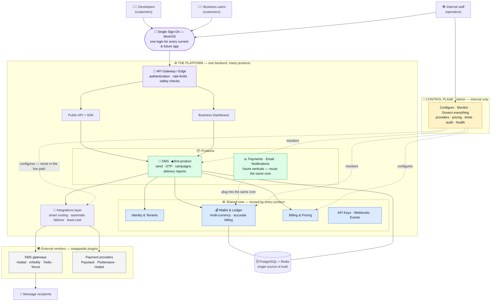

# Platform — Stakeholder Overview Diagram

**Date:** 2026-05-31 · A single "system on a page" for non-technical and technical stakeholders.
Render/export: paste the diagram into <https://mermaid.live> → export PNG/SVG for slides.

---

## The diagram

---

## How to present it — the story in 5 lines

1. **One login for everyone.** Customers and staff sign in once (SSO); that identity works
   across every app we build now and in the future.
2. **One backend powers many products.** A shared core — wallet, identity, billing — is built
   once and reused. SMS is the first product on top of it.
3. **New products plug in, they aren't rebuilt.** Payments, Email, Notifications later reuse the
   same wallet, login, and billing — so each new product is faster and cheaper to ship, and
   customers get one account, one wallet, one bill.
4. **Vendors are swappable plugins with automatic failover.** We're not locked to any SMS gateway
   or payment provider; if one fails we route around it automatically — higher reliability, lower
   cost, no lock-in.
5. **An admin control plane runs the business.** Staff configure pricing, providers, and limits
   and monitor everything from one place — but it stays out of the live traffic path, so customer
   messages keep flowing even during admin changes.

## Legend (colour coding)
- 🟪 **Purple** — entry points (login, gateway)
- 🟦 **Blue** — shared core reused by all products
- 🟩 **Green** — products (SMS today, more later)
- 🟨 **Amber** — internal admin / control plane
- ⬜ **Grey** — external vendors (pluggable)
- **Dashed lines** — the admin configures/monitors *out of band* (never in the live path)

## The one-sentence pitch
> *One login, one wallet, one backend — SMS today, more products tomorrow — with swappable
> vendors and automatic failover so messages actually arrive, all run from a single admin console.*
