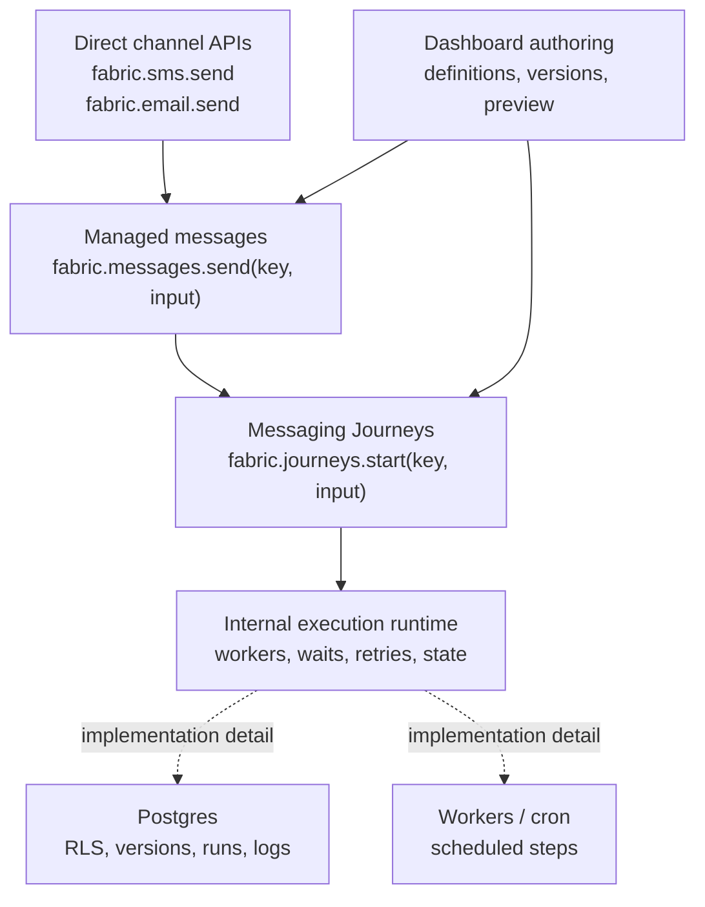
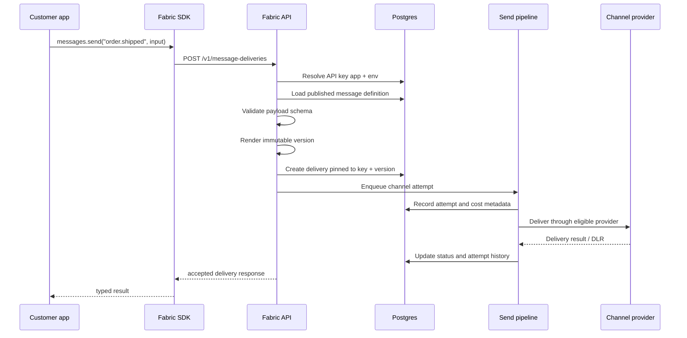
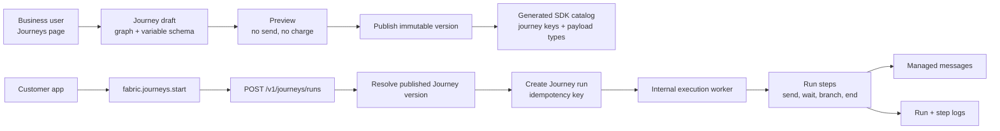
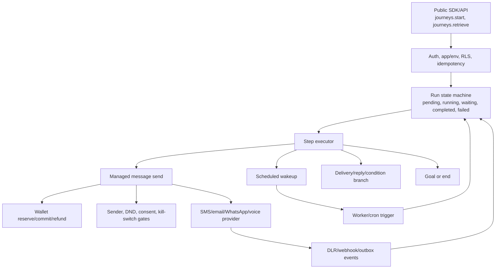
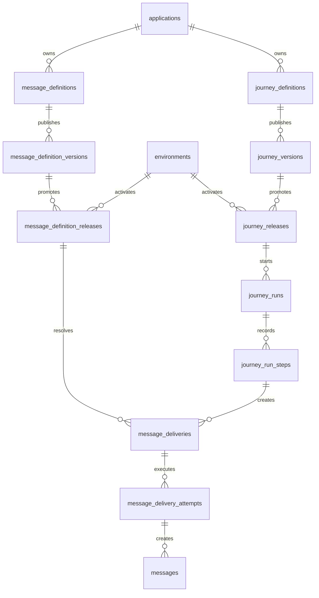

# Managed Messaging And Journeys Architecture Plan

> Status: proposed - Product direction agreed 2026-07-15 - Not yet implemented

The [final managed messaging SDK contract](./sdk-dx-iteration-3.md) is authoritative for managed-message
resources, acceptance, money, version, environment, idempotency, permission, privacy, webhook, and
response contracts. The Journey sequencing in this plan still stands.
Delivery work is tracked as complete vertical capabilities in the
[managed messaging SDK backlog](./managed-messaging-sdk-backlog.md); horizontal components in this
plan are not independently releasable features.

This plan clarifies the SDK direction after the managed-messaging discussion:

- Journeys were not removed from Fabric.
- Journeys are deferred from the first executable SDK iteration.
- Iteration one focuses on managed SMS messages because it is the foundation Journeys will call.
- The workflow engine is an internal runtime, not the public product or SDK abstraction.

## Product Layers

Fabric should expose three product layers without forcing a developer to adopt all of them at once:



The SDK speaks in Fabric concepts: direct sends, managed messages, Journeys, and runs. It should not
expose arbitrary workflow-engine concepts such as generic activities, task queues, or graph
interpreters.

## Scope Decision

| Area | First SDK iteration | Future iteration |
| --- | --- | --- |
| Direct SMS | Keep supported | Keep supported |
| Managed messages | Implement for SMS | Add email, WhatsApp, voice variants |
| Typed catalogs | Generate message keys and payload types | Include Journey keys and payload types |
| Dashboard authoring | Message definitions, preview, publish, Use in code | Journey drafts, preview, publish, run logs |
| Journeys | Document target contract only | Persist and execute published Journeys |
| Workflow engine | Not exposed | Internal runtime for Journey execution |
| Live automation | Not enabled | Enable only after durable execution and safety gates |

The reason is practical: a Journey runtime requires durable scheduling, idempotent runs, step
recovery, wallet safety, sender/compliance gates, and observability. Managed messages prove the
contract and delivery path first.

## Managed Message Architecture

Managed messages are the foundation. A developer sends a stable business key; Fabric resolves the
published definition for the API key's application and environment.



Important rules:

- The stable key is the developer contract.
- Published versions are immutable.
- Rendering happens server-side.
- The API validates payloads even when the SDK generated compile-time types.
- Direct channel APIs remain available for fully dynamic sends.

## Journey Architecture

A Journey is a dashboard-authored messaging automation. It can reference managed messages and run
multiple steps over time.



The SDK starts or inspects a Journey run. It does not execute the Journey graph. The server owns all
state transitions, waits, retries, and side effects.

## Internal Runtime Boundary

The internal runtime may look like a workflow engine, but it should remain behind Fabric APIs.



This boundary prevents Fabric from becoming a generic workflow product. We can change the internal
runtime later without changing `fabric.journeys.start`.

## Data Model Direction

The exact schema should be generated through Drizzle when implemented, but the ownership boundaries
should be:



Every tenant-scoped table must use RLS. Application and environment are part of the resolution
boundary because API keys are scoped there.

## Database Invariants

The final schema names are produced through Drizzle, but these invariants are mandatory:

| Invariant | Database enforcement |
| --- | --- |
| Stable key belongs to one application | `UNIQUE (tenant_id, application_id, key)` on definitions |
| Published content never changes | Version rows are insert-only for runtime roles; no update/delete grant |
| Version ordinal is unambiguous | `UNIQUE (definition_id, version)` |
| One active release per definition/environment | `UNIQUE (tenant_id, environment_id, definition_id)` with composite containment FKs |
| Release cannot cross application or tenant | Composite FKs include tenant, application, definition, and environment ownership |
| Managed retry creates one resource | `UNIQUE (tenant_id, application_id, environment_id, operation, idempotency_key_hash)` |
| Replay input cannot change | Non-null canonical request hash stored beside the idempotency hash |
| Attempt belongs to one delivery | Composite tenant FK plus `UNIQUE (delivery_id, ordinal)` |
| One attempt has one channel message | Unique nullable channel-message FK populated when the attempt is created |
| Money never floats or changes currency | `bigint` minor columns, three-character currency, one currency per delivery |
| Aggregate status cannot regress | Transactional row lock plus monotonic `resource_version` and terminal-state guard |
| Every external event matches committed state | Outbox insert in the same transaction as the delivery/attempt transition |

Every new tenant-owned table uses FORCE RLS and has a cross-tenant denial integration test through
the real runtime role. Runtime reads include tenant, application, and environment predicates even
though RLS remains the workspace isolation boundary.

Required hot-path indexes include:

- released definition by environment and stable key;
- delivery by environment and ID;
- delivery by environment, reference, creation time, and ID for keyset search;
- pending attempts by `available_at` and ID;
- Journey run steps by run and execution order;
- webhook deliveries by next-attempt time and terminal state;
- retention scans by encrypted-content expiry.

Workers claim bounded batches with row locking/`SKIP LOCKED` semantics, update attempt counters, and
commit state before claiming more work. Redis may accelerate scheduling but is never the only record
of a delivery, wait, retry, reservation, or webhook.

## Webhook Fan-Out And Recovery

Managed events require per-endpoint delivery state. A single attempt counter on the outbox event is
not sufficient: if one endpoint succeeds and another fails, retrying the whole event resends the
successful endpoint unnecessarily and cannot show which endpoint is dead.

Add a tenant-scoped `webhook_deliveries` record for each `(event_id, endpoint_id)` with:

- status: `pending | delivered | dead`;
- attempt count and next-attempt timestamp;
- last HTTP status/error category, never response body or secret;
- delivered/dead timestamps;
- a unique event/endpoint constraint.

The poller first materializes endpoint-delivery rows from a committed outbox event, then workers
retry each row independently with bounded exponential backoff and jitter. Successful endpoints are
not called again because another endpoint failed. Endpoint removal disables future fan-out but does
not rewrite audit history.

Dead deliveries remain visible in the dashboard and operator metrics. A user-authorized replay
creates an audited new delivery attempt for the same event/endpoint; it does not edit the historical
failure or mint a new domain event. Consumers still deduplicate by event ID because a timeout can
occur after their endpoint accepted a request but before Fabric observed the response.

The first managed-event live gate requires metrics for pending age, attempts, delivered, retrying,
dead, signature failures reported by customers, and worker sweep failures.

## Migration And Rollout

The managed model is additive and does not rewrite existing direct SMS/email history:

1. Normalize the beta vocabulary in contracts and SDK release notes: public environment
   `sandbox | live`, canonical direct webhook names, opaque IDs, and stable key grammar.
2. Add contracts and additive tables for definitions, versions, releases, deliveries, attempts,
   durable idempotency, and per-endpoint webhook delivery.
3. Add RLS/grants in journaled raw SQL, then prove runtime-role isolation before exposing routes.
4. Ship internal definition management and sandbox preview with no provider side effects.
5. Ship the managed SMS acceptance transaction and production worker behind a managed-messaging
   kill-switch; keep live disabled.
6. Ship SDK/CLI beta, dashboard Use in code, logs, typed webhooks, and sandbox documentation in the
   same public-contract change.
7. Soak sandbox with deterministic provider outcomes, worker restarts, duplicate requests, webhook
   faults, and reconciliation checks.
8. Enable live managed SMS only after ADR ratification, security/wallet review, approved bindings,
   operational dashboards, rollback instructions, and explicit human authorization.

Existing `sms_templates` rows are not backfilled automatically. They remain workspace SMS snippets;
an explicit dashboard conversion creates a new application definition and draft so users review the
key, schema, environment, sender binding, and content before publishing.

The beta environment-value change (`production` to `live`) receives a changelog entry, compile-time
migration example, and at least one beta release before 1.0. Internal database enums may retain
legacy values behind serializers; public clients see only the canonical vocabulary.

## Verification Matrix

| Risk | Required evidence |
| --- | --- |
| Contract drift | Zod/OpenAPI/SDK contract tests plus clean-project SDK and CLI compilation |
| Tenant/application/environment isolation | Real-Postgres runtime-role integration tests, including forged app/environment IDs |
| Version immutability and promotion race | Concurrent publish/send tests proving old-or-new complete release, never mixed state |
| Duplicate sends or charges | Concurrent same-key tests, timeout replay, delayed replay beyond generic TTL, ledger reconciliation |
| Worker crash | Crash injection after reservation, outbox insert, provider acceptance, and status transition; recovery trigger tested |
| Wallet correctness | Reserve/commit/refund invariants for priority, fallback, broadcast, cost ceiling, and provider fault |
| Compliance | Acceptance and attempt-time tests for sender revocation, STOP/DND, quiet hours, and unknown approval state |
| Sandbox isolation | Tests proving every sandbox route uses fake/virtual providers despite live bindings |
| Webhook reliability | Duplicate, timeout-after-accept, out-of-order, endpoint-specific failure, dead-letter, and replay tests |
| SDK type safety | Compile fixtures for key/data/channel/locale plus runtime rejection from widened/untyped callers |
| Rendering security | Injection, escaping, size/depth/array limits, invalid media URL, secret-pattern and error-redaction tests |
| Amplification | Rate/cost/attempt/step limits under broadcast and Journey load tests |
| Release artifact | Existing `release:check`, packed install, ESM import, API sandbox smoke, and changelog review |

CI blocks on unit, contract, lint, typecheck, deterministic worker tests, and the applicable
real-Postgres suite. Live readiness additionally requires a sandbox UAT evidence pack and operational
sign-off; a green unit suite alone is insufficient for money or asynchronous delivery correctness.

## Implementation Plan

### Iteration 1: Managed SMS Foundation

1. Add application/environment-scoped message definitions.
2. Support draft and immutable published versions.
3. Add variable schemas and runtime validation.
4. Add server-side SMS rendering and preview.
5. Add `fabric.messages.send` and `fabric.messages.preview`.
6. Generate TypeScript catalogs for message keys and payload types.
7. Add a dashboard definition editor with Use in code examples.
8. Record message key, definition version, rendered SMS metadata, cost, and provider status.

Validation gates:

- tenant and environment isolation integration tests;
- published-version immutability tests;
- payload validation tests;
- idempotency conflict tests;
- preview does not charge or send;
- sandbox cannot reach live providers.

### Iteration 2: Journey Authoring Foundation

1. Move the current dashboard Journey schema from local-only code into `@app/contracts`.
2. Replace loose `Record<string, string>` configs with discriminated node contracts.
3. Persist Journey drafts under tenant, application, and environment RLS.
4. Add preview-only validation against executable node kinds.
5. Keep Publish disabled for live execution.
6. Add Use in code for the planned Journey key and payload schema.

Validation gates:

- persisted drafts are tenant-isolated;
- unsupported nodes cannot publish;
- graph validation catches unreachable steps and missing starts;
- generated catalogs include Journey keys only after a publishable contract exists.

### Iteration 3: Sandbox Journey Execution

1. Add Journey published versions.
2. Add `fabric.journeys.start`, `fabric.journeys.preview`, and `fabric.journeys.retrieve`.
3. Add durable Journey run and step records.
4. Execute a narrow graph: start -> managed SMS -> wait -> delivery branch -> managed SMS/end.
5. Add a production worker/cron trigger for waits and recovery.
6. Show run status and step logs in the dashboard.

Validation gates:

- run idempotency;
- crash-safe scheduled waits;
- retry/recovery tests;
- run logs show every step;
- sandbox sends never use live providers.

### Iteration 4: Live Journey Execution

1. Enable live publishing only behind explicit product and operational gates.
2. Reuse wallet reservation, sender approval, DND/consent, and kill-switch checks from direct sends.
3. Add failure and compensation paths for partial Journey execution.
4. Add alerts and operational dashboards for stuck runs and failed steps.

Validation gates:

- wallet path fails closed;
- control-plane checks use the correct fail-open/fail-closed posture;
- stuck run recovery is tested through the worker trigger;
- live publish requires executable node support and safety checks.

### Iteration 5: Channel And Trigger Expansion

Add channels and triggers only after their direct/managed primitives are real:

- email variants;
- WhatsApp templates and provider approval;
- voice scripts;
- inbound-message triggers;
- contact-list triggers;
- wait-for-reply branches;
- localization and channel fallback.

## SDK Shape

The TypeScript SDK should eventually look like this:

```ts
type FabricCatalog = {
  messages: {
    "order.shipped": {
      customerName: string;
      orderReference: string;
      eta: string;
    };
  };
  journeys: {
    "order.delivery_followup": {
      customerName: string;
      orderReference: string;
      eta: string;
    };
  };
};

const fabric = new Fabric<FabricCatalog>({
  apiKey: process.env.FABRIC_API_KEY!,
});

await fabric.messages.send(
  "order.shipped",
  {
    recipient: { phone: "+233201234567" },
    data: {
      customerName: "Ama",
      orderReference: "ORD-123",
      eta: "4 PM",
    },
  },
  { idempotencyKey: "order.shipped:ORD-123" },
);

await fabric.journeys.start(
  "order.delivery_followup",
  {
    recipient: { phone: "+233201234567" },
    data: {
      customerName: "Ama",
      orderReference: "ORD-123",
      eta: "4 PM",
    },
  },
  { idempotencyKey: "order.delivery_followup:ORD-123" },
);
```

`messages` and `journeys` share the same principles: stable keys, generated payload types, runtime
validation, server-side execution, idempotency, and observable results.

## Decision Summary

Journeys are future product scope, not removed scope. They should be implemented after managed
messages because they depend on the same definition, rendering, validation, idempotency, logging,
and delivery-safety foundation. The public SDK remains simple while Fabric can build a durable
internal runtime behind it.
