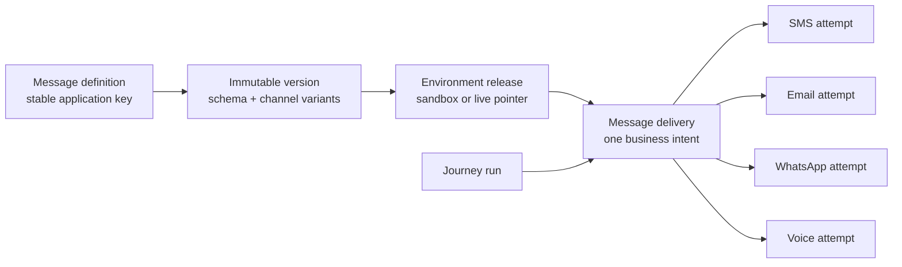
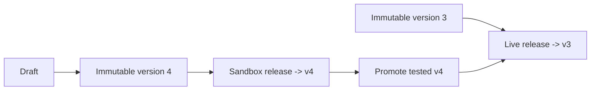

# Fabric SDK DX - Design Iteration 2

> Status: historical proposal - 2026-07-15 - Refined by
> [SDK DX design iteration 3](./sdk-dx-iteration-3.md) - Not implemented

This iteration pressure-tests the proposed SDK against the point where Fabric supports managed
SMS, email, WhatsApp, voice, routing, and Journeys. It does not add those capabilities to the
current SDK. The current executable surface remains the one in the
[SDK capability matrix](./README.md#current-api-capability-matrix).

The central decision is that `fabric.messages.send` creates a **message delivery**, not a single
channel message. One delivery represents the business intent and may create one or more channel
attempts over time. Direct resources such as `fabric.sms.send` continue to return one channel
message.

## What changed after iteration 1

The first proposal established stable keys, generated payload types, server-side rendering, and a
separate Journey abstraction. Those choices remain. This iteration corrects or sharpens five areas:

1. A routed or broadcast send cannot truthfully return one `selectedChannel` and one message ID.
   The public result must be a delivery aggregate with child attempts.
2. A message key should be stable across sandbox and live. The definition belongs to an
   application; each environment releases an immutable version of it.
3. `idempotencyKey` belongs in request options, matching the existing SDK. It is required for new
   managed-send and Journey-start methods.
4. Code generation improves compile-time safety but cannot be required for first success or trusted
   for runtime validation.
5. Content publishing and live promotion are management-plane operations. A runtime secret key
   that can send messages must not automatically be allowed to edit or publish definitions.

The architectural decisions are recorded in
[ADR 0005](../decisions/0005-managed-messaging-sdk-resource-model.md).

## Design constraints

The DX must remain understandable while satisfying these non-negotiable constraints:

- a secret key resolves the workspace, application, and environment; callers do not send those IDs;
- sandbox can never reach a live provider;
- every tenant-owned record is protected by FORCE RLS and queried inside tenant context;
- the API validates every payload even when generated TypeScript types compile;
- rendering uses an immutable version and happens on Fabric servers;
- retries cannot create a second delivery, charge, or Journey run;
- wallet reservation fails closed, while non-money control-plane checks follow the existing
  last-known-good/fail-open availability posture;
- message content, recipient addresses, secrets, and provider credentials do not appear in request
  logs, generated catalogs, idempotency keys, or normal error messages;
- provider approvals, sender identities, DND/consent, channel capability, and environment state are
  delivery gates, not passive metadata;
- the SDK is server-only and must preserve native cancellation and structured errors;
- future SDKs in other languages preserve concepts, not TypeScript syntax.

## Alternatives considered

| Option | Shape | Strength | Failure mode |
| --- | --- | --- | --- |
| Channel message result | `messages.send` returns one message | Smallest first implementation | Breaks when fallback, broadcast, or delayed routing creates multiple attempts |
| Delivery aggregate | `messages.send` returns a delivery with attempts | Stable across one or many channels; observable and reconcilable | Adds one domain object before the first managed SMS needs it |
| Workflow-first | Every message is a one-step Journey | One execution model | Makes simple sends expensive to understand and exposes automation concepts too early |
| Provider-template API | Caller passes provider template IDs | Familiar to provider-specific users | Leaks providers, prevents portable keys, and moves approval/version complexity into applications |

**Decision:** use the delivery aggregate. It is the smallest abstraction that remains honest when
the routing policy grows. Journeys call the same managed-delivery capability rather than replacing
it.

## Public resource model



The public concepts are:

- **definition** - an application-owned contract identified by a stable key;
- **version** - immutable data schema, channel content, locales, and routing policy;
- **release** - the version active in one environment;
- **delivery** - one accepted managed-send intent, including the resolved version and route plan;
- **attempt** - one channel-specific execution created by a delivery;
- **Journey run** - a durable automation execution that may create several deliveries.

The existing database `message_dispatches` and `email_dispatches` rows are worker dispatch records.
They are implementation details and are not the managed **delivery** resource described here.

## Target TypeScript experience

### Optional generated catalog

The default client remains usable without generation. Its managed keys are strings and its payload
data is `Record<string, unknown>`; the server still validates them. Teams that want compile-time
safety generate a deterministic catalog:

```bash
pnpm fabric definitions generate --output src/fabric.generated.ts
pnpm fabric definitions check --input src/fabric.generated.ts
```

The generated module contains contracts, not message bodies, recipients, credentials, provider
identifiers, or timestamps:

```ts
export interface FabricCatalog {
  messages: {
    "order.shipped": {
      data: {
        customerName: string;
        orderReference: string;
        eta: string;
      };
      channels: "sms" | "email";
      locales: "en-GH" | "en-NG";
    };
  };
  journeys: {
    "order.delivery-follow-up": {
      data: {
        customerName: string;
        orderReference: string;
      };
    };
  };
}
```

Generation is environment-aware because the API key identifies the environment. CI should normally
generate from sandbox, where the next compatible contract is released and tested before promotion.
The output is stable for source control: sorted keys and fields, no generated-at timestamp, and a
schema digest in a comment for drift checks.

Generated TypeScript improves inference but does not make values exact in every program. TypeScript
is structurally typed, so excess-property checks are strongest on inline object literals and can be
bypassed accidentally when data passes through a wider variable. Generated helpers should support
the `satisfies` operator for local checking, while the API must reject unknown fields at runtime.
Persisted schemas use closed objects by default (`additionalProperties: false`) to catch typos and
avoid silently accepting unnecessary PII.

### Managed send

The key remains a separate argument because it gives the best autocomplete and payload inference.
The idempotency key remains a request option because it describes HTTP execution, not message
content:

```ts
import { Fabric } from "@fabric-messaging/sdk";
import type { FabricCatalog } from "./fabric.generated.js";

const fabric = new Fabric<FabricCatalog>({
  apiKey: process.env.FABRIC_API_KEY!,
});

const result = await fabric.messages.send(
  "order.shipped",
  {
    recipient: {
      phone: "+233201234567",
      email: "ama@example.com",
    },
    data: {
      customerName: "Ama",
      orderReference: "ORD-123",
      eta: "4 PM",
    },
    locale: "en-GH",
  },
  { idempotencyKey: "order.shipped:ORD-123" },
);
```

Omitting `channel` delegates routing to the released definition. A caller may constrain the route
when the business operation requires it, but cannot select a channel absent from the generated
contract or active release:

```ts
await fabric.messages.send(
  "order.shipped",
  { recipient: { phone }, data, channel: "sms" },
  { idempotencyKey },
);
```

Direct channel calls remain the lower-level escape hatch:

```ts
await fabric.sms.send(
  { to: phone, senderId: "Fabric", body: dynamicBody },
  { idempotencyKey },
);
```

Managed calls use `recipient`; direct channel calls keep their native `to`/`from` vocabulary. The
first managed slice supports inline addresses only. A future stored-recipient form must be an
exclusive union with inline addresses so precedence is never ambiguous:

```ts
type Recipient =
  | { id: string; phone?: never; email?: never }
  | { id?: never; phone?: string; email?: string };
```

### Delivery response and retrieval

The SDK keeps its existing `FabricResponse<T>` wrapper so request metadata is not a breaking change.
The managed resource inside it is channel-neutral:

```ts
interface MessageDelivery {
  id: string; // dlv_...
  messageKey: string;
  definitionVersion: number;
  status:
    | "accepted"
    | "processing"
    | "delivered"
    | "partially_delivered"
    | "undelivered"
    | "failed";
  policy: "priority" | "fallback" | "broadcast";
  attempts: ReadonlyArray<{
    id: string;
    channel: "sms" | "email" | "whatsapp" | "voice";
    status: string;
  }>;
  createdAt: string;
}
```

`accepted` means Fabric durably recorded the intent; it does not mean a provider accepted or an end
user received it. The initial response may contain no attempts if routing is asynchronous. The
application observes completion through retrieval or signed webhooks:

```ts
const delivery = await fabric.messages.retrieve(result.data.id);
```

The API should expose this resource through a dedicated wire endpoint such as
`POST /v1/message-deliveries` and `GET /v1/message-deliveries/:id`. This avoids changing the meaning
of the existing SMS-oriented `GET /v1/messages` during the beta migration. The SDK hides that wire
naming from normal use.

Aggregate terminal status follows stable rules:

- `delivered` means at least one required attempt delivered and the policy is satisfied;
- `partially_delivered` applies only to broadcast when some, but not all, required attempts deliver;
- `undelivered` means attempts reached providers but the policy completed without delivery;
- `failed` means Fabric could not complete an eligible attempt because of a platform, configuration,
  compliance, or provider-submission failure.

Routing policies must also define when the next channel is allowed to start. The first multi-channel
slice uses conservative semantics:

- `priority` selects the first eligible channel during planning and does not react to a later send
  failure;
- `fallback` advances only when an attempt fails before provider acceptance;
- `broadcast` starts every eligible channel intentionally.

A later carrier `undelivered` status does not trigger fallback by default. Triggering a second
channel after provider acceptance can create duplicate customer communications when delivery
reports are late or wrong, so any future `fallbackOn: "undelivered"` behavior must be an explicit
policy with dashboard warnings and tests. Consent and DND gates apply independently to every
attempt; fallback can never be used to evade a blocked channel.

### Preview

Preview uses the same released version, schema validator, renderer, eligibility rules, and pricing
calculator as send, but never creates a delivery, reserves money, contacts a provider, or emits a
delivery webhook:

```ts
const preview = await fabric.messages.preview("order.shipped", {
  recipient: { phone: "+233201234567" },
  data,
  channel: "sms",
  locale: "en-GH",
});
```

Its result is a plan, not a promise of delivery. It should include:

- resolved key, version, locale, and policy;
- channel previews as a discriminated union;
- SMS encoding, segments, sender, sender status, and estimated cost;
- environment and recipient eligibility;
- structured `blocker` and `warning` issues with stable codes and field paths;
- unresolved runtime decisions, such as a fallback that depends on a future delivery report.

Provider availability may change after preview. Send therefore repeats every gate and can still
fail safely.

## Definition, version, and environment semantics

A definition key is unique within an application, not duplicated independently per environment.
Its immutable versions are also application-owned. Each environment has a release pointer to one
version:



This model gives one stable key to application code while allowing sandbox to lead live. Promotion
moves the exact tested version; it does not copy editable content and create a different version.

Environment-specific delivery bindings remain separate from content versions. Examples include an
SMS sender identity, an email sending domain, a provider route, or a WhatsApp approval record. A
binding or approval may reference a particular definition version, channel, and locale when the
provider requires content approval. Live promotion fails closed if required bindings or approvals
are not ready.

The existing `sms_templates` resource remains a useful SMS composition snippet. It is not silently
promoted into a managed definition because it lacks an application key, variable schema, immutable
versions, environment releases, and channel bindings. A later dashboard migration may explicitly
convert a template into a definition.

## Contract compatibility

The stored variable schema should use a documented, portable JSON Schema subset. Zod remains the
TypeScript boundary validator, but persisted customer-defined schemas cannot depend on TypeScript.
The first subset should allow bounded objects, required/optional properties, strings, booleans,
integers, numbers, and bounded arrays. It should reject arbitrary code, recursive schemas, remote
references, and unbounded payloads.

Compatibility is evaluated against the released schema:

- adding an optional field is backward-compatible;
- adding a required field is breaking;
- removing or renaming a field is breaking;
- narrowing a type or allowed value is breaking;
- widening an accepted value is input-compatible;
- content-only edits are contract-compatible but still create an immutable version;
- removing a channel or locale used by callers is breaking for generated contracts.

The dashboard and CLI must show compatibility before release. A breaking sandbox version may be
released deliberately for coordinated development, but live promotion requires an explicit human
acknowledgement and evidence that dependent applications updated. Fabric does not infer safety from
TypeScript generation alone because callers may use stale catalogs or other languages.

## Idempotency and retry semantics

Managed sends require a non-empty caller-provided idempotency key. The SDK must retain it across
automatic retries and must never generate a fresh value per attempt.

The server scopes a key to the resolved tenant, application, environment, and operation. It stores a
canonical request fingerprint and the first durable result. Reusing the key with the same request
returns the original delivery; reusing it with different input returns an `idempotency_conflict`.
The key must not contain a phone number, email address, message body, or other PII.

Version resolution and delivery creation are one transaction. If version 4 is active on the first
request and version 5 is released before a retry, the retry still returns the delivery pinned to
version 4. Validation failures that create no durable intent may be corrected and retried according
to the documented retention rules.

The transport only retries managed writes automatically when an idempotency key is present. Timeout
or cancellation means **outcome unknown**, not "not sent"; the caller retrieves by a known result or
retries with the same idempotency key.

## Permissions and trust boundaries

Iteration two separates runtime and management authority:

| Authority | Proposed scope | Allows |
| --- | --- | --- |
| Direct channel | `sms:send`, `email:send`, later channel peers | Explicit channel sends |
| Managed runtime | `messages:send` | Preview or execute the active delivery policy for a published definition |
| Managed read | `messages:read` | Retrieve managed deliveries and attempts |
| Contract tooling | `definitions:read` | Fetch keys and schemas for generation; never send or publish |
| Journey runtime | `journeys:start`, `journeys:read` | Start and inspect published Journey runs |
| Management plane | Session role or future management credential | Draft, publish, promote, bind providers |

`messages:send` deliberately delegates channel selection to the published policy. It is broader than
`sms:send`, so the API-key screen must describe that authority clearly. Teams needing a hard channel
boundary use direct channel scopes or a managed definition constrained to that channel. Fabric must
not let a normal runtime send key edit content, change routing, approve a sender, or promote live.

Requiring both `messages:send` and every possible channel scope would appear narrower, but it would
make a business-owned policy change fail unpredictably in deployed applications. The proposed
single managed scope makes delegation explicit. If customers later need one key to use managed
content while hard-limiting its channels, add an API-key `allowedChannels` constraint rather than
silently mixing the two authorization models.

The exact scope migration requires a separate security review because the current closed scope
catalog and some implemented endpoints still use channel scopes. No endpoint should accept a new
scope until the dashboard, guard, tests, and documentation agree.

## Errors and observability

The SDK continues to throw structured subclasses of `FabricError`. Managed messaging adds stable
codes for:

- `message_definition_not_found`;
- `message_not_released`;
- `message_payload_invalid` with bounded field issues;
- `message_channel_unavailable`;
- `message_locale_unavailable`;
- `recipient_address_missing`;
- `sender_not_approved` or equivalent channel-binding failures;
- `compliance_blocked` without leaking sensitive registry detail;
- `insufficient_balance`;
- `idempotency_conflict`;
- `environment_locked`.

Each accepted delivery records the API request ID, key, immutable version, environment, route plan,
attempts, cost reservations/resolutions, and originating Journey run/step when present. Logs display
recipient addresses masked by default and never depend on provider IDs as the customer correlation
key.

Existing channel message events remain backward-compatible. Managed deliveries add distinct,
versioned event types rather than changing the payload of `message.delivered` in place. Event
payloads include a unique event ID, delivery ID, definition key/version, aggregate status, and
bounded attempt summaries. Delivery remains at-least-once through the transactional outbox, so
customers deduplicate by event ID.

## How Journeys fit

Journeys remain the next automation layer:

```ts
await fabric.journeys.start(
  "order.delivery-follow-up",
  { recipient: { phone }, data },
  { idempotencyKey: "order.delivery-follow-up:ORD-123" },
);
```

A Journey run returns a run resource, not a delivery. Each send node creates a managed delivery and
links it to the run and step. The workflow runtime stays internal.

For reproducibility, a Journey run should snapshot the active releases of every statically
referenced message definition when the run starts. A message release promoted while a run is
waiting affects new runs, not the meaning of an existing run. This costs extra version references
but makes audit, retry, preview, and incident reconstruction reliable.

Journeys do not absorb direct or managed sends:

- use `sms.send` for explicit, fully dynamic SMS;
- use `messages.send` for one reusable business communication;
- use `journeys.start` for a durable multi-step automation.

## Delivery sequence

```mermaid
sequenceDiagram
  participant App as Customer application
  participant SDK as Fabric SDK
  participant API as Public API
  participant DB as Postgres
  participant Worker as Delivery worker
  participant Provider as Provider

  App->>SDK: messages.send(key, input, idempotency)
  SDK->>API: Create managed delivery
  API->>DB: Resolve app + environment release
  API->>API: Validate schema and eligibility
  API->>DB: Transaction: idempotency + delivery + version snapshot
  API-->>SDK: accepted delivery
  Worker->>DB: Claim route step
  Worker->>DB: Reserve wallet funds
  Worker->>Provider: Send channel attempt
  Provider-->>Worker: acknowledgement / later status
  Worker->>DB: Update attempt and aggregate delivery
  Worker->>DB: Commit or refund wallet; append outbox event
  API-->>App: Signed delivery webhook
```

## Implementation increments

This is a design iteration. Implementation should be split into reviewable vertical increments:

### DX2-A - Contract and storage spine

- accept ADR 0005 and name the public resources consistently;
- define contracts for definition, immutable version, environment release, delivery, attempt, and
  preview issue;
- generate tenant-safe schema and RLS policies;
- add application-level key uniqueness and environment release constraints;
- specify request fingerprints, idempotency retention, and aggregate statuses.

Gate: real-Postgres tests prove tenant isolation, version immutability, release integrity, and
idempotency under concurrency.

### DX2-B - Managed SMS vertical slice

- implement sandbox definition authoring, version release, preview, send, and retrieve;
- render the released version server-side and create one SMS attempt through the existing pipeline;
- record definition/version/delivery linkage and wallet lifecycle;
- add dashboard Use in code and delivery logs;
- keep current direct SMS behavior unchanged.

Gate: preview/send parity, no provider call from preview, no sandbox-to-live route, idempotent retry,
sender/compliance blocks, and exact wallet reconciliation.

### DX2-C - Generated TypeScript contracts

- add read-only contract endpoint and least-privilege scope;
- generate deterministic TypeScript from the portable schema subset;
- add `definitions check` for CI drift;
- add typed `messages.send`, `preview`, and `retrieve` without requiring generation;
- document stale-catalog and breaking-release workflows.

Gate: compile-time fixtures reject wrong keys, missing fields, unknown inline fields, invalid
channels, and invalid locales; runtime tests reject all invalid payloads from an untyped or
structurally widened client.

### DX2-D - Multi-channel proof

- add one real second managed channel only after its direct provider path and approval gates exist;
- exercise priority/fallback with multiple attempts;
- add aggregate retrieval and managed-delivery webhooks;
- verify environment-specific bindings and live promotion readiness.

Gate: a single SDK call remains unchanged while the definition routes between two eligible channels,
and logs explain every decision and cost.

Journey authoring and execution continue in the separately sequenced architecture plan after the
managed-delivery spine is proven. DX2-D can proceed alongside Journey authoring; a second managed
channel is not a prerequisite for the first SMS-only Journey runtime.

## Acceptance criteria

The second SDK design is ready for implementation when:

- a new developer can still send a direct sandbox SMS without creating or generating anything;
- a typed user gets key, data, channel, and locale autocomplete from a deterministic catalog;
- an untyped or stale client receives the same runtime validation and stable error codes;
- every managed write requires a stable idempotency key and replay cannot change its pinned version;
- a content editor can release to sandbox and promote the exact tested version to live;
- live promotion fails closed when sender, provider, domain, or template approval is incomplete;
- a managed response remains truthful for one attempt, fallback attempts, and broadcast attempts;
- retrieval and webhooks correlate the delivery intent, attempts, costs, and originating Journey;
- runtime send credentials cannot publish definitions or promote live;
- adding email, WhatsApp, voice, or a Journey send node does not require a new top-level send model.

## Explicit non-goals

- replacing direct channel APIs;
- making every send a Journey;
- executing templates or Journey graphs in the SDK;
- exposing provider template IDs as normal application contracts;
- accepting arbitrary executable template logic or unrestricted JSON Schema;
- adding contacts, bulk campaigns, scheduling, cancellation, or stored recipients in this slice;
- publishing content with a normal runtime send key;
- promising delivery synchronously from an accepted API response.

## External design references

The design borrows proven ideas without copying another provider's resource model:

- [Knock generates language types from committed trigger-data schemas](https://docs.knock.app/developer-tools/type-safety),
  supporting the decision to make schemas the source of generated contracts;
- [Stripe treats idempotency as request execution metadata](https://docs.stripe.com/api/idempotent_requests)
  and rejects key reuse with changed parameters, supporting request options plus request
  fingerprints;
- [Twilio separates reusable multi-channel content from provider delivery](https://www.twilio.com/docs/content/overview)
  and exposes channel eligibility/approval, reinforcing the need for channel variants and
  environment bindings.

Fabric's additional constraints - tenant RLS, exact wallet accounting, sandbox isolation, sender and
consent gates, and future Journey execution - determine the final shape.
